# Medisphere: Integrated Telemedicine Platform

> A comprehensive digital healthcare solution enabling seamless doctor-patient collaboration through real-time communication, AI-powered medical insights, and intelligent appointment management.

## 📚 Documentation Structure

This monorepo contains comprehensive documentation organized by service:

- **[Main README](./README.md)** - You are here (High-level overview)
- **[Frontend Service README](./medisphere-app/README.md)** - Next.js app, components, hooks
- **[Signaling Service README](./medisphere-signaling-server/README.md)** - Express + Socket.io, WebRTC signaling
- **[ARCHITECTURE.md](./ARCHITECTURE.md)** - Deep dive into system design patterns
- **[SETUP_GUIDE.md](./SETUP_GUIDE.md)** - Detailed development environment setup
- **[QUICK_REFERENCE.md](./QUICK_REFERENCE.md)** - Fast command reference

---

## 📋 Table of Contents

1. [Introduction](#introduction)
2. [Purpose](#purpose)
3. [Problem Statement & Objectives](#problem-statement--objectives)
4. [Proposed System & Methodology](#proposed-system--methodology)
5. [System Architecture (HLD & LLD)](#system-architecture-hld--lld)
6. [Tools & Technologies](#tools--technologies)
7. [Quick Start](#quick-start)
8. [Command Reference](#command-reference)
9. [Architecture Decisions](#architecture-decisions)

---

## Introduction

Medisphere is designed as a multi-role healthcare system for patients, doctors, and administrators. The platform combines:

- Clinical workflow support (appointments, reports, prescriptions, reviews)
- Real-time communication (chat + WebRTC calls via Socket.io signaling)
- AI-assisted interactions (chat, document/image understanding, speech support)
- Role-governed operations and secure data handling
- Multilingual user experience for broader accessibility

This repository contains two deployable services:

- `medisphere-app` (Next.js 15 app with UI + API routes)
- `medisphere-signaling-server` (Express + Socket.io signaling service)

## 2. Project Purpose

The project purpose is to digitize end-to-end outpatient consultation workflows while improving accessibility, reducing waiting/travel overhead, and making healthcare interactions more continuous and data-driven.

## 3. Problem Statement & Objectives

### Problem Statement

Traditional healthcare access suffers from fragmented patient experience: in-person dependency, poor continuity, delayed follow-up communication, and weak digital record handling. Existing solutions often lack integrated real-time consultation, AI support, and role-specific operational workflows in one system.

### Objectives

1. Provide role-aware digital healthcare journeys for patients, doctors, and admins.
2. Support remote consultation through secure real-time video and messaging.
3. Enable operational continuity through appointments, records, prescriptions, and follow-up communication.
4. Improve decision support and patient literacy with AI and curated health knowledge APIs.
5. Maintain secure, scalable architecture with strong data modeling and modular services.

---

### Problem Statement
The current healthcare ecosystem suffers from:
- **Fragmentation**: Doctors and patients use separate apps for calls, messages, records, payments
- **Accessibility**: Rural/remote patients face barriers to specialist consultations
- **Inefficiency**: Manual appointment scheduling, paper records, duplicate information entry
- **Data Loss**: No centralized patient history across consultations
- **Poor Decision Support**: Doctors lack quick access to drug/disease information

### Objectives
1. **Unified System**: Single platform for consultations, messaging, appointments, payments
2. **Accessibility**: Enable consultations from any location with internet
3. **Efficiency**: Automate scheduling, maintain centralized records
4. **Data Continuity**: Retain full consultation history with prescriptions
5. **Clinical Support**: Integrate real-time medical knowledge

---

## 4. Proposed System & Methodology

### System Architecture

The system is implemented as a modular, service-oriented web architecture:

- **Frontend Service**: Next.js 15 application provides UI and integrated API routes
- **Signaling Service**: Dedicated Express + Socket.io server for real-time events and WebRTC orchestration
- **Data Layer**: MySQL with Prisma ORM for type-safe database access
- **External Integrations**: AI (Gemini), Knowledge APIs (openFDA, MedlinePlus), Payments (Razorpay), Auth (OAuth)

### Engineering Methodology

1. **Domain Decomposition**: Split into auth, appointments, reports, chat, video, AI, admin modules
2. **Contract-First APIs**: Define API schemas before implementation
3. **Type Safety**: TypeScript across frontend + backend with Prisma auto-generated types
4. **Progressive Hardening**: Start MVP, then add security, validation, error handling
5. **Cross-Platform**: Windows and Unix scripts for reproducible local development

---

## 5. System Architecture (HLD & LLD)

### High-Level Design (HLD)

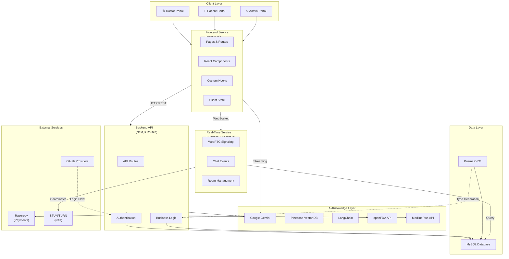

### Service Landscape - All Components

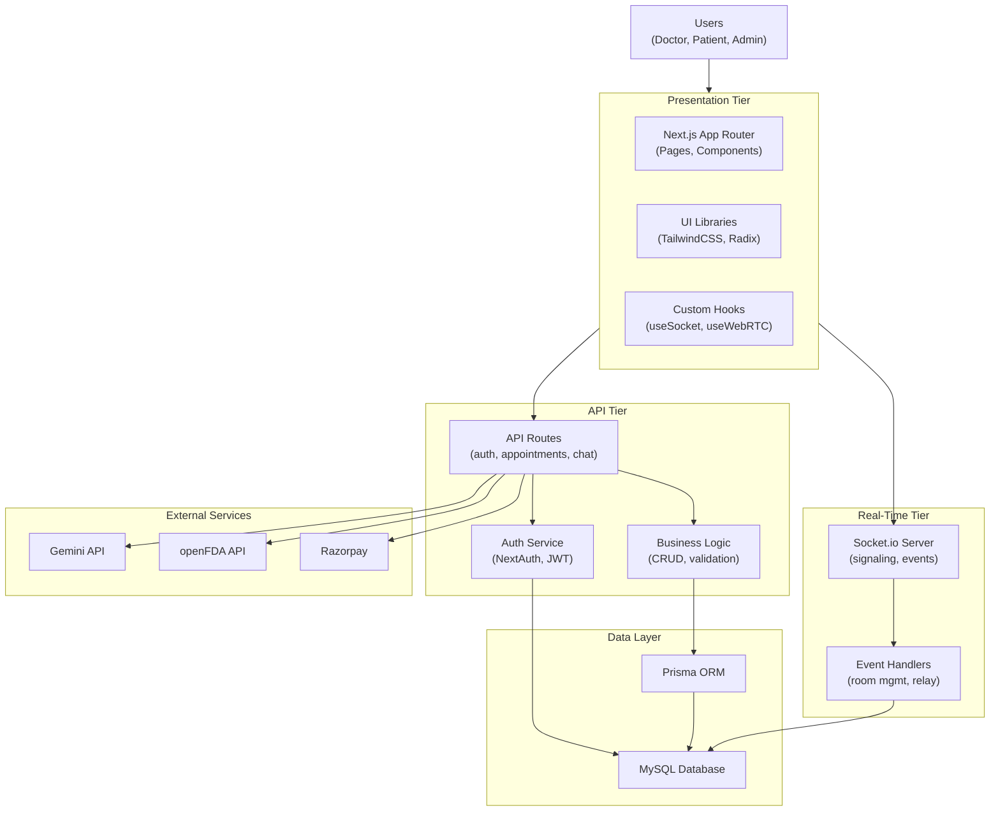

### Next.js Service - Low-Level Design

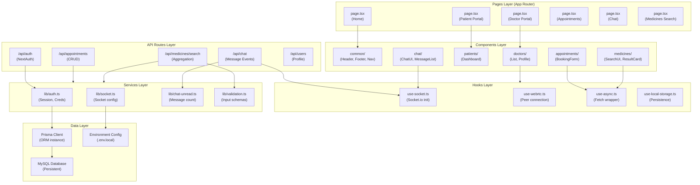

### Signaling Service - Low-Level Design

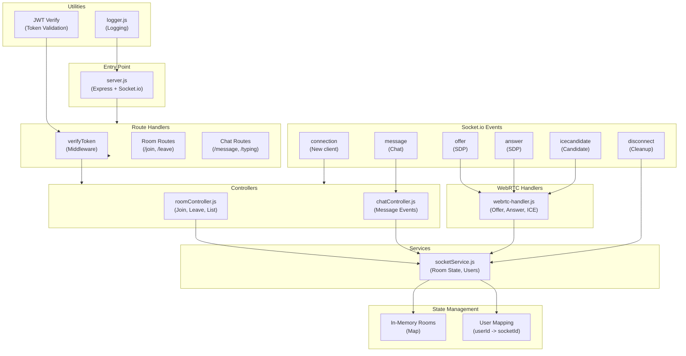

### Doctor-Patient Call Sequence Diagram

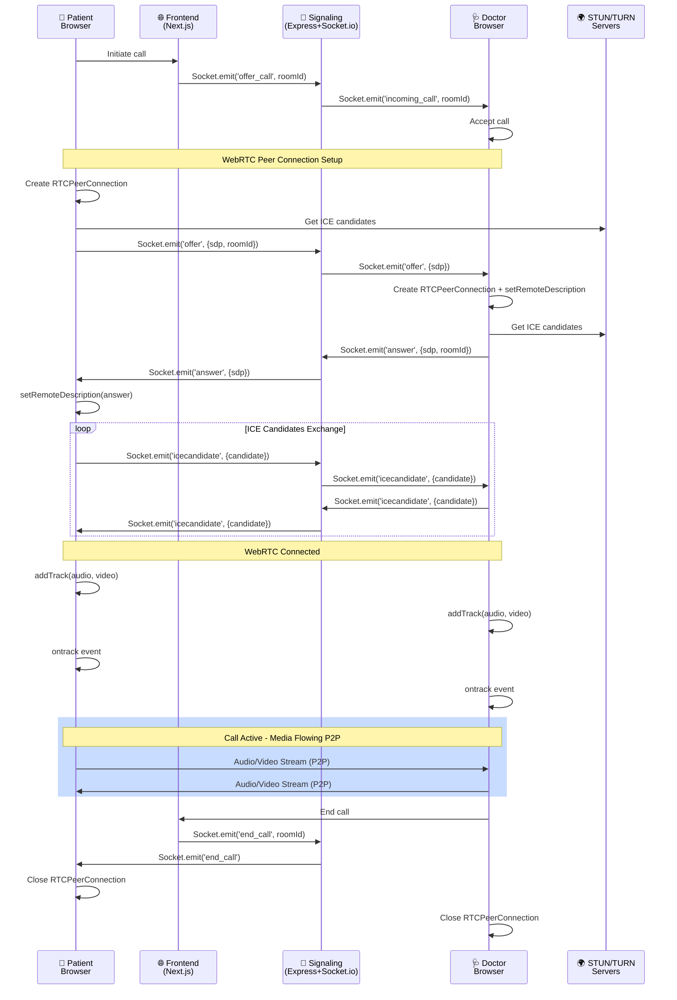

### Database Entity-Relationship Diagram

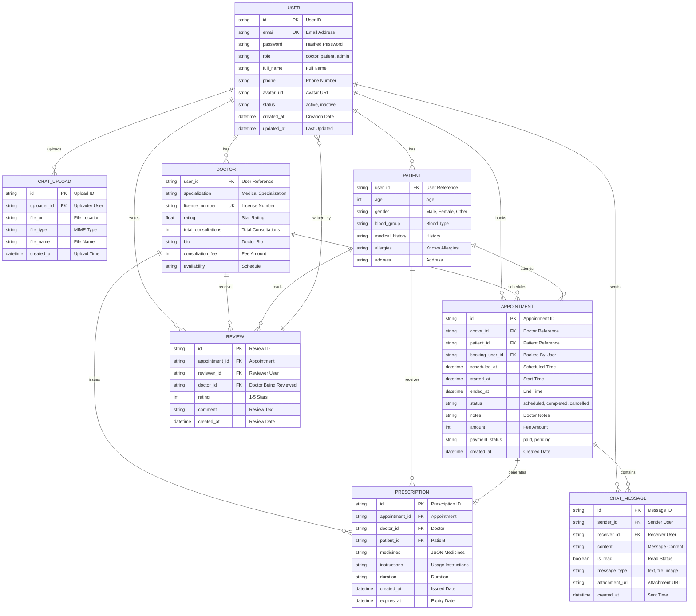

---

## 6. Tools & Technologies

The implementation follows an iterative, module-driven methodology:

1. Domain decomposition: split into auth, appointments, reports, chat, video, AI, admin modules.
2. Contract-first APIs: route-level handlers encapsulate validation, auth checks, and response schemas.
3. Shared abstractions: hooks (`use-webrtc*`, `use-socket*`) and utility libs (`lib/*`) reduce duplication.
4. Progressive hardening: role guards, secure headers, JWT/session checks, encryption for sensitive blobs.
5. Cross-platform operability: Windows and Unix setup/start scripts for reproducible local environments.

### 5.3 Functional Method Flow (Example: Knowledge Search)

1. User submits disease/medicine query from the medicines knowledge UI.
2. Backend route calls openFDA drug labels and MedlinePlus health topics.
3. Response data is sanitized/normalized for readability.
4. UI renders article-style content with follow-up suggestions and typo assistance.

## 6. System Architecture / Design (HLD and LLD)

### 6.1 High-Level Design (HLD)

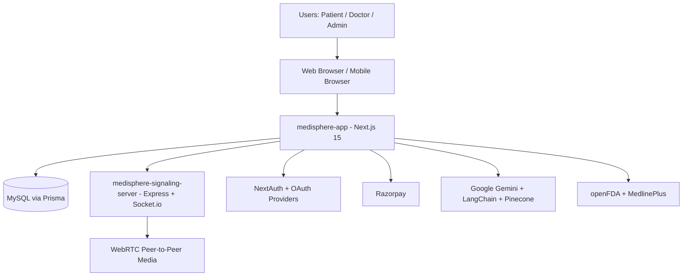

### 6.2 Service Landscape (All Services)

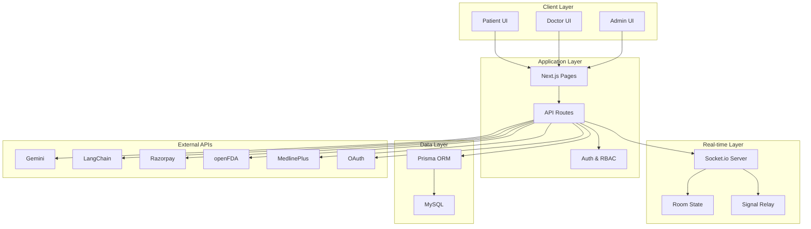

### 6.3 Layered Architecture

- Presentation Layer: Next.js App Router pages and reusable React components.
- Application Layer: API routes for auth, appointments, reports, payments, AI, medicines knowledge.
- Real-time Layer: Socket.io signaling service + room orchestration + event relays.
- Data Layer: MySQL schema managed through Prisma models and relations.
- Integration Layer: AI, payment, OAuth, and public health APIs.

### 6.4 Low-Level Design (LLD)

#### A. LLD - Next.js Service Internal Design

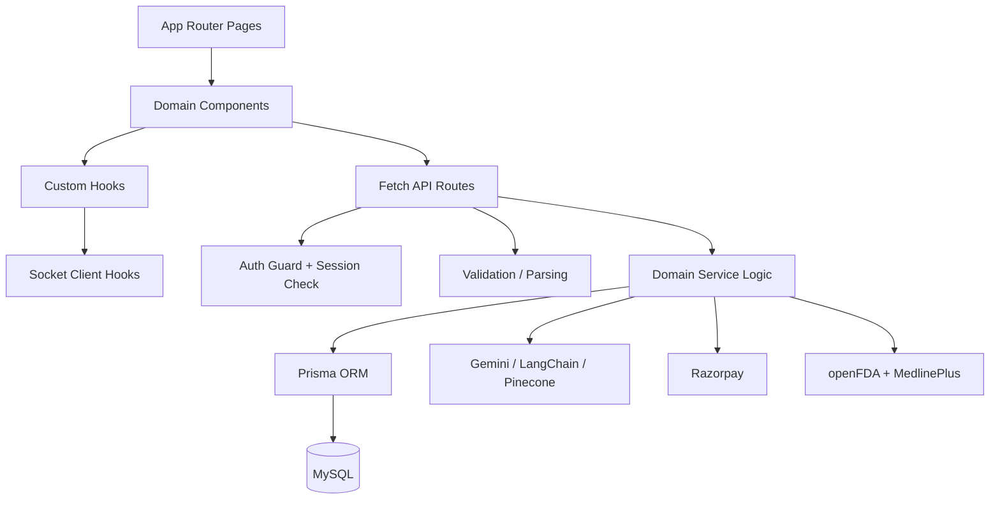

#### B. LLD - Signaling Service Internal Design

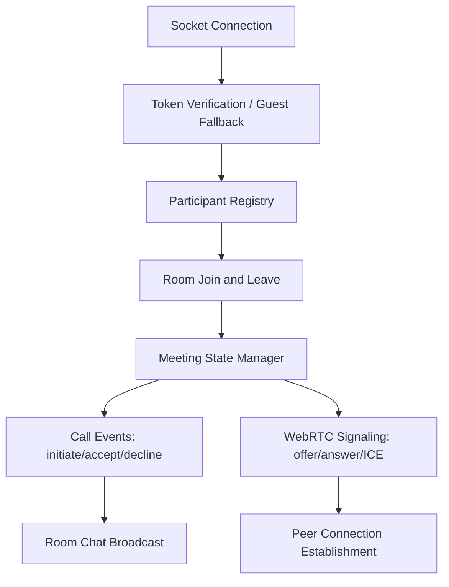

#### C. LLD - Doctor to Patient Call Sequence

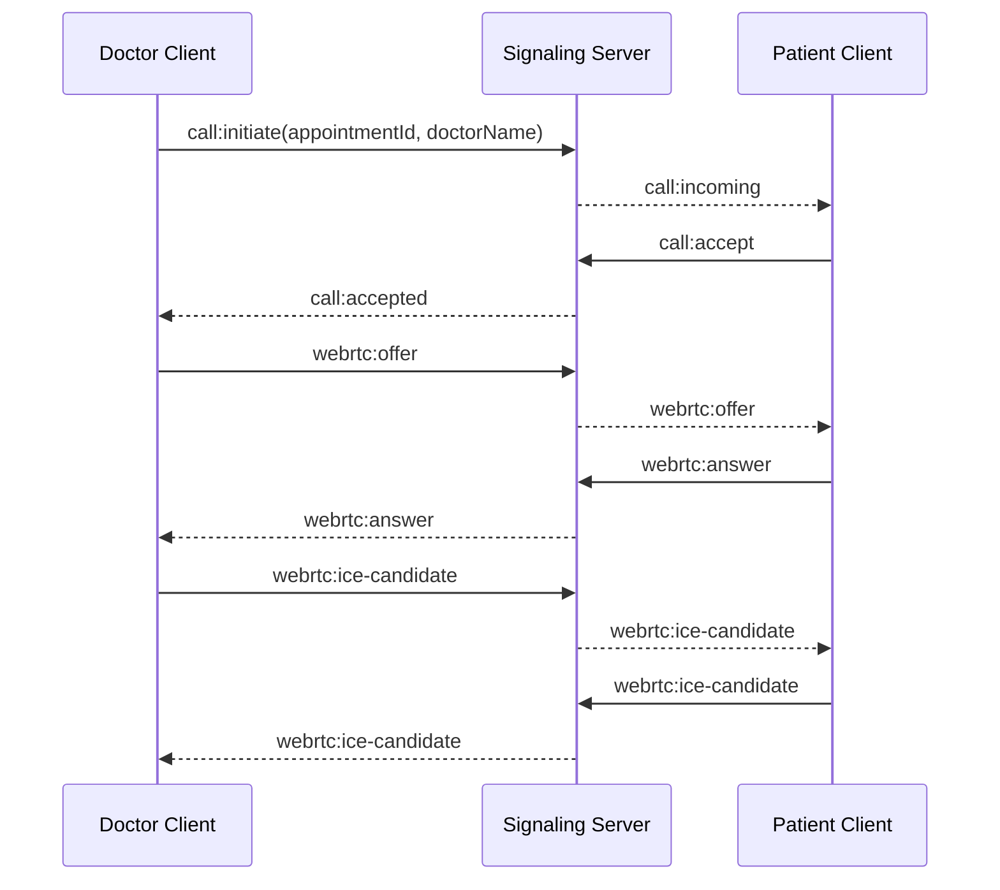

#### D. LLD - Data Model View

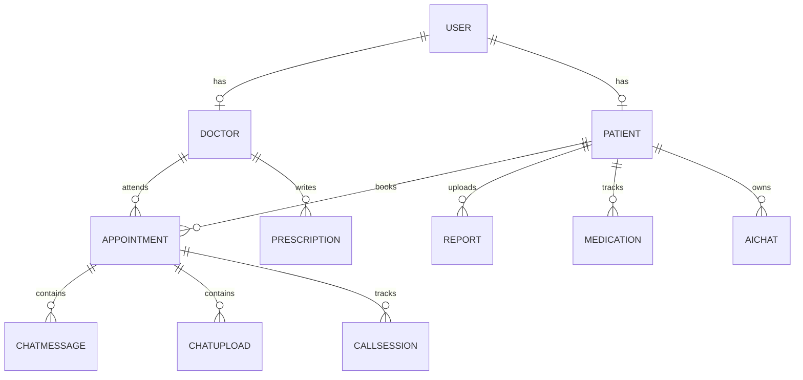

#### E. Core Services and Responsibilities

| Module | Primary Responsibility |
|---|---|
| `src/app/api/auth` | Authentication + session management integration |
| `src/app/api/appointments` | Appointment lifecycle APIs |
| `src/app/api/reports` | Report upload/download and metadata management |
| `src/app/api/ai` | AI chat, document/image processing endpoints |
| `src/app/api/medicines/search` | openFDA + MedlinePlus aggregation and normalization |
| `medisphere-signaling-server/server.js` | Socket server bootstrap, room events, call signaling |
| `medisphere-signaling-server/src/webrtc-handler.js` | Offer/answer/ICE relay and meeting participant state |

#### F. Data Model Essentials

Important entities in `prisma/schema.prisma` include:

- `User`, `Doctor`, `Patient` (identity and role context)
- `Appointment` (doctor-patient interaction anchor)
- `Report`, `ChatUpload` (clinical artifact storage)
- `Prescription`, `Medication` (treatment continuity)
- `ChatMessage`, `CallSession` (communication tracking)
- `AIChat`, `Review`, `AuditLog` (assistant history, quality, observability)

#### G. Real-Time Call Flow (Simplified LLD)

1. Doctor emits call initiation event for an appointment.
2. Signaling server notifies room participants with incoming call event.
3. Patient accepts and joins meeting context.
4. WebRTC exchange begins with offer/answer and ICE candidate relays.
5. Peer connection establishes media streams.
6. Leave/end events clean up meeting state.

#### H. Security Design Notes

- Session/JWT-aware route protection and role checks.
- Helmet-based secure headers in signaling service.
- Password hashing (`bcryptjs`) and token validation (`jose`/`jsonwebtoken`).
- Sensitive binary data support with encrypted storage patterns.

## 7. Tools & Technologies Used

### 7.1 Frontend and Full-Stack Framework

| Technology | Usage |
|---|---|
| Next.js 15 | App Router UI, server rendering, API routes |
| React 19 | Component model and client interactions |
| TypeScript | Type safety and maintainable contracts |
| Tailwind CSS | Utility-first styling and responsive layouts |
| Framer Motion + Radix UI | Interaction and accessible primitives |

### 7.2 Backend and Data

| Technology | Usage |
|---|---|
| Next.js Route Handlers | Domain APIs inside app service |
| Prisma ORM | DB access, model typing, migrations |
| MySQL | Primary relational datastore |
| NextAuth | Credentials/OAuth authentication integration |

### 7.3 Real-Time and Communication

| Technology | Usage |
|---|---|
| Socket.io | Real-time signaling and event transport |
| WebRTC | Peer-to-peer audio/video communication |
| Express | Signaling server runtime |
| STUN infrastructure | NAT traversal support |

### 7.4 AI and External Integrations

| Technology | Usage |
|---|---|
| Google Gemini | Medical assistant chat and reasoning support |
| LangChain + Pinecone | Orchestration and retrieval-oriented AI workflows |
| Razorpay | Appointment/payment workflows |
| openFDA + MedlinePlus | Drug label and disease/topic knowledge retrieval |

## 8. Repository Structure

```text
medispherev7/
├── medisphere-app/                 # Next.js monolith app (UI + APIs)
│   ├── src/app/                    # Routes/pages/API handlers
│   ├── src/components/             # UI modules by domain
│   ├── src/hooks/                  # Reusable client hooks
│   ├── src/lib/                    # Utilities/services
│   ├── src/types/                  # Shared TS types
│   └── prisma/schema.prisma        # Database schema
├── medisphere-signaling-server/    # Express + Socket.io signaling service
│   ├── server.js
│   └── src/webrtc-handler.js
├── SETUP_GUIDE.md
├── STARTUP_GUIDE.md
├── WEBRTC_SETUP.md
└── PROJECT_REPORT.md
```

## 9. Setup and Run

### Quick Setup

1. Run initial setup script once:
   - Windows: `setup.bat`
   - macOS/Linux: `./setup-dev.sh`
2. Configure environment files:
   - `medisphere-app/.env.local`
   - `medisphere-signaling-server/.env`
3. Run database migration/generation from `medisphere-app`:
   - `npx prisma migrate dev --name init`
   - `npx prisma generate`
4. Start both services:
   - Windows: `start-medisphere.bat` or `start-dev.bat`
   - macOS/Linux: `./start-dev.sh`

### Local Endpoints

- Frontend: `http://localhost:3000`
- Signaling Health: `http://localhost:4000/health`

## 10. Command Reference

### 10.1 Setup Commands

```bash
# Windows
setup.bat

# macOS/Linux
chmod +x setup-dev.sh start-dev.sh stop-dev.sh
./setup-dev.sh
```

### 10.2 Start Commands

```bash
# Windows (all services)
start-medisphere.bat

# Alternative Windows starter
start-dev.bat

# macOS/Linux (all services)
./start-dev.sh
```

### 10.3 Manual Service Start

```bash
# Terminal 1
cd medisphere-signaling-server
npm run dev

# Terminal 2
cd medisphere-app
npm run dev
```

### 10.4 Database Commands

```bash
cd medisphere-app
npx prisma generate
npx prisma migrate dev --name init
npx prisma studio
```

### 10.5 Build and Production Commands

```bash
cd medisphere-app
npm run build
npm run start

cd ../medisphere-signaling-server
npm run start
```

### 10.6 Health and Verification Commands

```bash
# App health check (HTML response expected)
curl http://localhost:3000

# Signaling service health check (JSON expected)
curl http://localhost:4000/health
```

## 11. Documentation Map

- `PROJECT_REPORT.md`: Full project report and domain context.
- `DOCTOR_PATIENT_CALL_FLOW.md`: Doctor-initiated incoming-call flow.
- `SETUP_GUIDE.md`: Detailed setup and testing path.
- `STARTUP_GUIDE.md`: Startup, configuration, and deployment notes.
- `WEBRTC_SETUP.md`: WebRTC-oriented setup and troubleshooting.
- `QUICK_REFERENCE.md`: Fast operational command reference.
