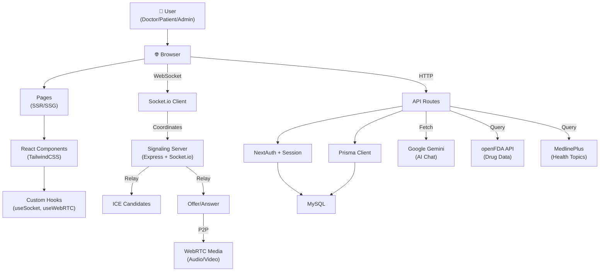

# Medisphere Frontend Service - Next.js 15

> A full-stack Next.js 15 with React 19 application serving doctor, patient, and admin portals with integrated API routes.

## 📚 Service Documentation Map

- **[← Back to Main README](../README.md)** - Medisphere overview
- **[Frontend Service README](./README.md)** - You are here
- **[Signaling Service README](../medisphere-signaling-server/README.md)** - Express + Socket.io
- **[ARCHITECTURE.md](../ARCHITECTURE.md)** - System design patterns

---

## 📋 Table of Contents

1. [Overview](#overview)
2. [Architecture](#architecture)
3. [Project Structure](#project-structure)
4. [Key Components & Hooks](#key-components--hooks)
5. [API Routes](#api-routes)
6. [Database Models](#database-models)
7. [Development Setup](#development-setup)
8. [Building & Deployment](#building--deployment)
9. [Troubleshooting](#troubleshooting)
10. [Performance Optimization](#performance-optimization)

---

## Overview

The Medisphere frontend service is a monolithic Next.js application providing:

- **Three Portals**: Doctor, Patient, and Admin dashboards with role-based access control
- **Real-Time Communication**: WebSocket-based chat and WebRTC video calls via Socket.io
- **Appointment Management**: Scheduling, confirmation, rescheduling, and payment integration
- **AI-Powered Search**: Medical knowledge aggregation with spell correction and suggestions
- **Type-Safe Backend**: API routes with Prisma ORM for type-safe database access

### Service Roles
| Portal | Features |
|--------|----------|
| **Doctor Portal** | View appointments, start consultations, issue prescriptions, view patient reports |
| **Patient Portal** | Book appointments, attend consultations, view prescriptions, access medical knowledge |
| **Admin Portal** | Manage users, view analytics, control platform configuration, moderate content |

---

## Architecture

### Service-Level Architecture



### Request Flow Examples

#### Appointment Booking
```
User Input → BookingForm Component
    ↓
useAsync Hook (fetch POST /api/appointments)
    ↓
API Route Handler (/api/appointments) 
    ↓
Auth Check (NextAuth session)
    ↓
Validation (Doctor exists, slot available)
    ↓
Database (Create Appointment record via Prisma)
    ↓
Razorpay? (If payment required)
    ↓
Response with Appointment ID
    ↓
UI Update (Redirect to confirmation)
```

#### Real-Time Chat Message
```
User Types → ChatInput Component
    ↓
Socket.io Client: socket.emit("message", {text})
    ↓
Signaling Server receives event
    ↓
Emit to recipient: socket.emit("message:received", {text})
    ↓
Recipient's useSocket hook receives data
    ↓
Update React state → Re-render message list
    ↓
Parallel: API POST /api/chat/messages (persistence)
```

---

## Project Structure

### Directory Hierarchy

```
medisphere-app/
├── src/
│   ├── app/                          # App Router routes
│   │   ├── (auth)/                  # Public authentication routes
│   │   │   ├── login/page.tsx
│   │   │   ├── register/page.tsx
│   │   │   └── layout.tsx
│   │   │
│   │   ├── doctor/                  # Protected doctor portal
│   │   │   ├── page.tsx             # Dashboard
│   │   │   ├── appointments/
│   │   │   │   └── [id]/page.tsx
│   │   │   ├── patients/
│   │   │   │   └── [id]/page.tsx
│   │   │   ├── prescriptions/
│   │   │   ├── analytics/
│   │   │   └── layout.tsx
│   │   │
│   │   ├── patient/                 # Protected patient portal
│   │   │   ├── page.tsx             # Dashboard
│   │   │   ├── appointments/
│   │   │   ├── doctors/
│   │   │   ├── medicines/
│   │   │   ├── prescriptions/
│   │   │   ├── reports/
│   │   │   └── layout.tsx
│   │   │
│   │   ├── admin/                   # Protected admin portal
│   │   │   ├── page.tsx             # Overview dashboard
│   │   │   ├── users/               # User management
│   │   │   ├── analytics/           # Platform metrics
│   │   │   ├── doctors/             # Doctor moderation
│   │   │   ├── settings/
│   │   │   └── layout.tsx
│   │   │
│   │   ├── api/                     # All API route handlers
│   │   │   ├── auth/
│   │   │   │   ├── [...nextauth]/route.ts  # NextAuth
│   │   │   │   └── register/route.ts
│   │   │   │
│   │   │   ├── appointments/        # CRUD operations
│   │   │   │   ├── route.ts        # GET /api/appointments, POST
│   │   │   │   └── [id]/route.ts   # GET, PATCH, DELETE
│   │   │   │
│   │   │   ├── chat/
│   │   │   │   ├── messages/route.ts
│   │   │   │   ├── upload/route.ts
│   │   │   │   └── conversations/route.ts
│   │   │   │
│   │   │   ├── medicines/
│   │   │   │   └── search/route.ts
│   │   │   │
│   │   │   ├── ai/
│   │   │   │   ├── chat/route.ts
│   │   │   │   └── analyze/route.ts
│   │   │   │
│   │   │   ├── doctors/
│   │   │   │   └── route.ts
│   │   │   │
│   │   │   ├── admin/
│   │   │   │   ├── users/route.ts
│   │   │   │   ├── analytics/route.ts
│   │   │   │   └── doctors/route.ts
│   │   │   │
│   │   │   └── health/route.ts
│   │   │
│   │   ├── globals.css              # TailwindCSS globals
│   │   ├── layout.tsx               # Root layout wrapper
│   │   └── page.tsx                 # Home page
│   │
│   ├── components/                  # Reusable React components
│   │   ├── admin/                   # Admin-specific components
│   │   │   ├── UserManagement.tsx
│   │   │   ├── AnalyticsDash.tsx
│   │   │   └── DoctorModeration.tsx
│   │   │
│   │   ├── appointments/            # Appointment features
│   │   │   ├── BookingForm.tsx
│   │   │   ├── BookingList.tsx
│   │   │   ├── RescheduleModal.tsx
│   │   │   └── ConfirmationCard.tsx
│   │   │
│   │   ├── auth/                    # Authentication UI
│   │   │   ├── LoginForm.tsx
│   │   │   ├── RegisterForm.tsx
│   │   │   └── OAuthButtons.tsx
│   │   │
│   │   ├── chat/                    # Chat functionality
│   │   │   ├── ChatUI.tsx
│   │   │   ├── ConversationList.tsx
│   │   │   ├── MessageInput.tsx
│   │   │   ├── MessageList.tsx
│   │   │   └── FileUpload.tsx
│   │   │
│   │   ├── common/                  # Shared components
│   │   │   ├── Header.tsx
│   │   │   ├── Footer.tsx
│   │   │   └── Navbar.tsx
│   │   │
│   │   ├── doctors/                 # Doctor-specific UI
│   │   │   ├── DoctorCard.tsx
│   │   │   ├── DoctorList.tsx
│   │   │   ├── DoctorProfile.tsx
│   │   │   └── AvailabilitySelector.tsx
│   │   │
│   │   ├── forms/                   # Reusable form components
│   │   │   ├── InputField.tsx
│   │   │   ├── SelectField.tsx
│   │   │   ├── DatePicker.tsx
│   │   │   └── FormWrapper.tsx
│   │   │
│   │   ├── medicines/               # Medicine search UI
│   │   │   ├── MedicineKnowledgeSearch.tsx    # Main search component
│   │   │   ├── MedicineSearchInput.tsx
│   │   │   ├── MedicineResultCard.tsx
│   │   │   ├── DiseaseResultCard.tsx
│   │   │   ├── ExpandableText.tsx
│   │   │   ├── SuggestionChips.tsx
│   │   │   └── PrebuiltTopics.tsx
│   │   │
│   │   ├── patients/                # Patient-specific components
│   │   │   ├── PatientDashboard.tsx
│   │   │   ├── MedicalHistory.tsx
│   │   │   └── ReportList.tsx
│   │   │
│   │   ├── prescriptions/           # Prescription display
│   │   │   ├── PrescriptionCard.tsx
│   │   │   ├── PrescriptionList.tsx
│   │   │   └── MedicationSchedule.tsx
│   │   │
│   │   ├── reports/                 # Medical reports
│   │   │   ├── ReportUpload.tsx
│   │   │   ├── ReportViewer.tsx
│   │   │   └── ReportHistory.tsx
│   │   │
│   │   ├── reviews/                 # Ratings & feedback
│   │   │   ├── ReviewForm.tsx
│   │   │   ├── ReviewList.tsx
│   │   │   └── StarRating.tsx
│   │   │
│   │   ├── video/                   # Video call UI
│   │   │   ├── VideoCall.tsx        # Main call interface
│   │   │   ├── LocalVideo.tsx
│   │   │   ├── RemoteVideo.tsx
│   │   │   ├── CallControls.tsx     # Mute, hang up, etc
│   │   │   ├── CallInitiator.tsx
│   │   │   ├── IncomingCallModal.tsx
│   │   │   └── VideoLayout.tsx
│   │   │
│   │   ├── layout/                  # Layout components
│   │   │   ├── Sidebar.tsx
│   │   │   ├── DoctorSidebar.tsx
│   │   │   ├── PatientSidebar.tsx
│   │   │   └── AdminSidebar.tsx
│   │   │
│   │   └── ui/                      # Radix UI Primitives
│   │       ├── Button.tsx
│   │       ├── Modal.tsx
│   │       ├── Dropdown.tsx
│   │       ├── Toast.tsx
│   │       └── ...
│   │
│   ├── hooks/                       # Custom React hooks
│   │   ├── use-async.ts             # Fetch wrapper with loading/error
│   │   ├── use-debounce.ts          # Debounce values
│   │   ├── use-geolocation.ts       # Browser geolocation
│   │   ├── use-local-storage.ts     # Persistent local storage
│   │   ├── use-multi-peer.ts        # Multiple WebRTC peers
│   │   ├── use-socket-client.ts     # Socket.io initialization
│   │   ├── use-socket.ts            # Socket.io event management
│   │   ├── use-speech-recognition.ts # Web Speech API
│   │   ├── use-webrtc.ts            # Main WebRTC peer connection
│   │   ├── use-webrtc-call.ts       # Call-specific logic
│   │   └── use-webrtc-peer.ts       # Peer connection helpers
│   │
│   ├── lib/                         # Utility libraries
│   │   ├── ai.ts                    # AI integration helpers
│   │   ├── auth.ts                  # Authentication utilities
│   │   ├── chat-unread.ts           # Unread message tracking
│   │   ├── constants.ts             # App-wide constants
│   │   ├── email.ts                 # Email send helpers
│   │   ├── encryption.ts            # Crypto utilities
│   │   ├── prisma.ts                # Prisma client singleton
│   │   ├── razorpay.ts              # Payment gateway helpers
│   │   ├── socket.ts                # Socket.io configuration
│   │   ├── types.ts                 # Shared utility types
│   │   ├── utils.ts                 # General utility functions
│   │   └── validation.ts            # Input validation schemas
│   │
│   ├── types/                       # TypeScript type definitions
│   │   ├── api.ts                   # API request/response types
│   │   ├── appointment.ts           # Appointment domain types
│   │   ├── auth.ts                  # Authentication types
│   │   ├── chat.ts                  # Chat message types
│   │   ├── doctor.ts                # Doctor profile types
│   │   ├── index.ts                 # Type re-exports
│   │   ├── next-auth.d.ts           # NextAuth type augmentation
│   │   ├── patient.ts               # Patient profile types
│   │   └── styles.d.ts              # CSS Modules typing
│   │
│   ├── messages/                    # i18n Localization
│   │   ├── en.json
│   │   ├── hi.json
│   │   ├── gu.json
│   │   ├── ta.json
│   │   ├── kn.json
│   │   ├── mr.json
│   │   └── ...
│   │
│   ├── i18n.ts                      # i18n Configuration
│   └── middleware.ts                # Next.js middleware for auth redirect
│
├── prisma/
│   ├── schema.prisma                # Prisma schema (DB models)
│   ├── migrations/                  # Database migration history
│   └── seed.ts                      # Optional seed script
│
├── public/                          # Static assets
│   ├── images/
│   ├── icons/
│   ├── fonts/
│   └── favicon.ico
│
├── scripts/
│   └── admin-grant.mjs              # CLI to grant admin role
│
├── .env.example                     # Environment template
├── package.json
├── tsconfig.json
├── next.config.ts
├── postcss.config.mjs
├── eslint.config.mjs
├── components.json                  # shadcn/ui config
└── README.md                        # You are here
```

### Key Files Quick Reference

| File | Purpose |
|------|---------|
| **src/app/layout.tsx** | Root layout component wrapping all pages |
| **src/middleware.ts** | Redirect unauthenticated users to login |
| **src/lib/auth.ts** | NextAuth configuration and session helpers |
| **src/lib/prisma.ts** | Prisma client singleton for database access |
| **src/components/layout/Sidebar.tsx** | Main navigation sidebar |
| **src/hooks/use-socket.ts** | Socket.io client initialization and auto-reconnect |
| **src/hooks/use-webrtc.ts** | WebRTC peer connection lifecycle management |
| **prisma/schema.prisma** | Single source of truth for data models |

---

## Key Components & Hooks

### Custom Hooks Overview

#### `use-socket.ts`
Manages Socket.io connection lifecycle with auto-reconnect logic.

```typescript
const socket = useSocket();

// Listen to events
socket.on('message:new', (msg) => setMessages([...messages, msg]));

// Emit events
socket.emit('call:initiate', { roomId, doctorName });
```

#### `use-webrtc.ts`
Controls WebRTC peer connections, local/remote streams, and media controls.

```typescript
const {
  localStream,
  remoteStream,
  call,          // initiate call
  answer,        // respond to offer
  hangup,        // end call
  toggleAudio,
  toggleVideo,
} = useWebRTC();
```

#### `use-async.ts`
Fetch wrapper with loading/error states and caching.

```typescript
const { data, loading, error } = useAsync(
  async () => {
    const res = await fetch('/api/appointments');
    return res.json();
  },
  []  // dependencies
);
```

#### `use-local-storage.ts`
Syncs React state with browser localStorage for persistence across sessions.

```typescript
const [theme, setTheme] = useLocalStorage('app-theme', 'light');
```

#### `use-socket-client.ts`
Initializes Socket.io connection with authentication token.

```typescript
const socket = useSocketClient();  // Auto-initializes with JWT
```

#### `use-debounce.ts`
Delays state updates for search inputs and form fields.

```typescript
const debouncedSearchTerm = useDebounce(searchInput, 300);  // 300ms delay
```

### Core Components Walkthrough

#### Medicine Knowledge Search (`MedicineKnowledgeSearch.tsx`)
**Purpose**: Aggregates drug and disease information with spell correction.

**Key Features**:
- Prebuilt topics dropdown (15 common diseases/medicines)
- Async search via `/api/medicines/search`
- Fuzzy spell-checking with Levenshtein distance
- Follow-up suggestion chips for exploration
- "Did you mean" amber alert for typos
- Full-width article-style results

**Component Props**:
```typescript
interface Props {
  onSearchComplete?: (term: string) => void;
  className?: string;
}
```

#### Chat UI (`components/chat/ChatUI.tsx`)
**Purpose**: Real-time conversation interface with message persistence.

**Features**:
- Message list with infinite scroll
- Socket.io event listeners (`message:received`, `typing`)
- File upload support
- Unread badge count
- Emoji picker
- Typing indicator

#### Video Call (`components/video/VideoCall.tsx`)
**Purpose**: WebRTC video consultation interface.

**Features**:
- Local and remote video streams
- Microphone/camera toggles
- Call duration timer
- Hang up button
- Network quality indicator
- Recording controls (future)

#### Appointment Booking (`components/appointments/BookingForm.tsx`)
**Purpose**: Doctor selection and time slot booking with payment.

**Steps**:
1. Doctor selection (with availability preview)
2. Date/time picker (real-time conflict detection)
3. Reason for visit (optional notes)
4. Razorpay payment (if doctor has fees)
5. Confirmation

---

## API Routes## 1. Introduction

The medisphere-app is the primary user-facing service in the Medisphere platform. It provides:

- **Multi-role Web UI**: Distinct interfaces for patients, doctors, and administrators
- **Domain APIs**: RESTful endpoints for authentication, appointments, reports, prescriptions, payments, AI chat, and medical knowledge
- **Real-time Integration**: Socket.io client connections for live chat, call signaling, and event streaming
- **Data Persistence**: Prisma ORM interface to MySQL for secure, scalable data management
- **External Integrations**: Google OAuth, Gemini AI, Razorpay, openFDA, MedlinePlus

The application is built with modern Next.js patterns including the App Router, server components, API route handlers, and TypeScript for type safety.

## 2. Project Purpose

The medisphere-app purpose is to:

1. **Digitize healthcare workflows** for patients, doctors, and administrative staff
2. **Provide unified access** to appointment scheduling, consultations, medical records, and prescriptions
3. **Enable continuous care** through messaging, call signaling, and follow-up management
4. **Support clinical decision-making** with AI assistance and curated medical knowledge APIs
5. **Secure user identity and data** through NextAuth integration, role-based access control, and encrypted storage

## 3. Feature Scope Classification (Big Features vs Small/Medium Features)

### Big Features (Platform-defining)

| Feature | Why it is a big feature |
|---|---|
| Role-based healthcare portal | Three distinct personas (Admin/Doctor/Patient), separate authorization boundaries, unique user journeys |
| Appointment and consultation lifecycle | Complete workflow from booking → confirmation → reschedule → completion → payment → follow-up |
| Real-time communication stack | Chat, WebRTC call signaling, room management, media controls, event streaming |
| AI assistant subsystem | Conversational AI, document/image processing, voice support, multi-language options |
| Medical data management | Reports, uploads, prescriptions, medications, patient history, relational integrity |

### Small to Medium Features (Focused capabilities)

| Feature | Description |
|---|---|
| Medicine and disease knowledge search | External aggregation from openFDA and MedlinePlus with spell correction |
| Doctor rating and review surfaces | Feedback collection and discoverability signals |
| Admin moderation and status controls | Operational governance over doctors and patient accounts |
| Utility hooks and component library | Reusable UI patterns and custom React hooks for maintainability |
| User session management | OAuth login, credential validation, session expiration, role preservation |

## 4. Problem Statement/Objectives

### Problem Statement

Traditional healthcare access suffers from:
- **Fragmented patient experience**: Dispersed information across providers, poor continuity of care
- **Operational inefficiency**: In-person dependency, manual scheduling, delayed follow-ups
- **Information asymmetry**: Limited access to medical knowledge and specialist insights
- **Poor digital support**: Weak record handling, lack of integrated communication, minimal decision support

Existing solutions often lack integrated real-time consultation, AI support, and role-specific operational workflows in one unified platform.

### Objectives

1. Provide role-aware digital healthcare journeys enabling self-service for patients and operational efficiency for doctors
2. Support remote consultation through secure real-time video, messaging, and document sharing
3. Enable operational continuity through appointments, medical records, prescriptions, and follow-up communication
4. Improve decision support and patient education with AI assistance and curated medical knowledge APIs
5. Maintain secure, scalable architecture with strong data modeling and modular service design
6. Support multiple languages and accessibility standards for broader healthcare reach

## 5. Proposed System / Methodology

### 5.1 Proposed System

The medisphere-app is implemented as:

- **Next.js 15 Stack**: App Router for pages, API route handlers for domain endpoints, server-side rendering for performance
- **React 19 Components**: Modular, reusable UI components organized by domain (auth, appointments, chat, reports, etc.)
- **Prisma ORM**: Type-safe database access with MySQL, enabling migrations and model versioning
- **NextAuth.js**: Multi-provider authentication (credentials + OAuth), session management, role preservation
- **Socket.io Client**: Real-time event subscriptions for chat, call signaling, notifications
- **External Integrations**: Google Gemini and LangChain for AI, Razorpay for payments, openFDA/MedlinePlus for medical knowledge

### 5.2 Engineering Methodology

The implementation follows iterative, module-driven design:

1. **Domain Decomposition**: Split functionality into auth, appointments, reports, chat, video, AI, medicines, and admin modules
2. **Contract-First APIs**: Each route handler encapsulates validation, authorization, error handling, and response serialization
3. **Shared Abstractions**: Custom hooks (`use-webrtc`, `use-socket`, etc.) and typed utility libraries reduce code duplication
4. **Progressive Hardening**: Role guards, secure headers, JWT/session verification, password hashing, encryption for sensitive data
5. **Type Safety**: Full TypeScript coverage with shared type definitions across API and UI layers
6. **Responsive Design**: TailwindCSS utility framework with Framer Motion animations for smooth UX

### 5.3 Functional Method Flow (Example: Medicine Knowledge Search)

\`\`\`
1. User navigates to Medicines page and enters a disease/medicine query
2. Frontend calls API route: /api/medicines/search?q=diabetes
3. API route fetches and aggregates data from openFDA and MedlinePlus APIs
4. Response data is sanitized, HTML entities decoded, and formatted
5. UI renders article-style content with:
   - Disease/medicine summary with expandable text
   - Follow-up suggestion chips for related topics
   - "Did you mean" spell correction with fuzzy matching
   - Prebuilt dropdown suggestions for common medicines/diseases
6. User can explore follow-up topics or navigate to doctor consultation
\`\`\`

## 6. System Architecture / Design (HLD and LLD)

### 6.1 Next.js App Internal High-Level Design

\`\`\`mermaid
graph TB
   subgraph Client["Client Layer"]
      U1["Patient UI"]
      U2["Doctor UI"]
      U3["Admin UI"]
   end

   subgraph AppRouter["App Router Pages"]
      P1["Pages: auth, appointments, chat, reports, medicines"]
      P2["Domain Components: forms, cards, modals, lists"]
   end

   subgraph APIRoutes["API Route Handlers"]
      R1["Authentication Routes"]
      R2["Appointment Routes"]
      R3["Report Routes"]
      R4["Chat Routes"]
      R5["AI Routes"]
      R6["Medicines Routes"]
      R7["Admin Routes"]
   end

   subgraph CoreLogic["Core Logic & Libraries"]
      L1["Socket.io Client Integration"]
      L2["Prisma ORM Client"]
      L3["NextAuth Session Handler"]
      L4["Email Service"]
      L5["AI Service Wrapper"]
      L6["Encryption Utils"]
   end

   subgraph DataLayer["Data Layer"]
      DB["MySQL Database"]
      CACHE["Session Cache"]
   end

   subgraph ExternalAPIs["External Services"]
      OA["Google OAuth"]
      GEMINI["Google Gemini API"]
      RAZORPAY["Razorpay"]
      OPENFDA["openFDA API"]
      MEDLINE["MedlinePlus API"]
      EMAIL["Email Service"]
   end

   Client --> AppRouter
   AppRouter --> APIRoutes
   APIRoutes --> CoreLogic
   CoreLogic --> DataLayer
   APIRoutes --> ExternalAPIs
   L2 --> DB
   L3 --> CACHE
\`\`\`

### 6.2 Low-Level Design (LLD) - Next.js App Service

#### A. Data Flow - Appointment Booking

\`\`\`mermaid
sequenceDiagram
   participant User as Patient UI
   participant Pages as Pages/Components
   participant API as API Route Handler
   participant Auth as NextAuth Session
   participant Prisma as Prisma ORM
   participant DB as MySQL
   participant Email as Email Service

   User->>Pages: Submit appointment form
   Pages->>API: POST /api/appointments/book
   API->>Auth: Verify session + patient role
   Auth-->>API: Session valid
   API->>Prisma: Create appointment record
   Prisma->>DB: INSERT appointment
   DB-->>Prisma: Appointment ID returned
   API->>Email: Send confirmation email
   API-->>Pages: 201 Created + appointmentId
   Pages-->>User: Show success + redirect to appointments
\`\`\`

#### B. Data Flow - Medicine Knowledge Search

\`\`\`mermaid
sequenceDiagram
   participant UI as Medicine Search UI
   participant API as /api/medicines/search
   participant OpenFDA as openFDA API
   participant MedlinePlus as MedlinePlus API
   participant Sanitizer as Text Sanitizer

   UI->>API: GET ?q=diabetes
   API->>OpenFDA: Fetch drug labels
   API->>MedlinePlus: Fetch topics XML
   OpenFDA-->>API: Drug data with HTML entities
   MedlinePlus-->>API: Topic data with markup
   API->>Sanitizer: Decode entities, clean HTML
   Sanitizer-->>API: Normalized text
   API-->>UI: Aggregated + cleaned results
   UI->>UI: Render article-style + suggestions
\`\`\`

#### C. Component Hierarchy - Authentication Flow

\`\`\`mermaid
graph TD
   AuthPage["Auth Pages<br/>login, signup, forgot-password"]
   AuthForms["Auth Forms<br/>credentials, oauth-button"]
   NextAuthLib["NextAuth.js Session<br/>Provider, useSession hook"]
   CredProvider["Credential Provider<br/>bcryptjs validation"]
   OAuthProvider["OAuth Provider<br/>Google strategy"]
   AppRouter["App Router Middleware<br/>redirects, role guards"]
   ProtectedPages["Protected Pages<br/>appointments, reports, chat"]

   AuthPage --> AuthForms
   AuthForms --> NextAuthLib
   NextAuthLib --> CredProvider
   NextAuthLib --> OAuthProvider
   CredProvider --> AppRouter
   OAuthProvider --> AppRouter
   AppRouter --> ProtectedPages
\`\`\`

#### D. Module Organization

\`\`\`mermaid
graph LR
   APP["src/app"]
   COMPONENTS["src/components"]
   HOOKS["src/hooks"]
   LIB["src/lib"]
   TYPES["src/types"]

   APP --> AUTH["api/auth"]
   APP --> APT["api/appointments"]
   APP --> REPORTS["api/reports"]
   APP --> CHAT["api/chat"]
   APP --> AI["api/ai"]
   APP --> MEDS["api/medicines"]
   APP --> ADMIN["api/admin"]

   COMPONENTS --> AUTH_C["auth/"]
   COMPONENTS --> APT_C["appointments/"]
   COMPONENTS --> REPORT_C["reports/"]
   COMPONENTS --> CHAT_C["chat/"]
   COMPONENTS --> DOCTORS_C["doctors/"]
   COMPONENTS --> MEDICINES_C["medicines/"]

   HOOKS --> WEBRTC["use-webrtc.ts,<br/>use-socket.ts"]
   HOOKS --> FORMS["use-async.ts,<br/>use-debounce.ts"]

   LIB --> AUTH_L["auth.ts, encryption.ts"]
   LIB --> DATA["prisma.ts, utils.ts"]
   LIB --> INTEGRATIONS["ai.ts, email.ts,<br/>razor pay.ts"]

   TYPES --> CORE["api.ts, auth.ts,<br/>appointment.ts"]
\`\`\`

#### E. API Route Structure and Security

\`\`\`mermaid
graph TD
   REQUEST["HTTP Request"]
   ROUTE["Route Handler"]
   VERIFY["Verify Session"]
   AUTHN["Check Authentication"]
   AUTHZ["Check Role Authorization"]
   VALIDATE["Parse + Validate Body"]
   LOGIC["Domain Logic"]
   PRISMA["Prisma Query"]
   RESPONSE["Format Response"]
   ERROR["Error Handler"]

   REQUEST --> ROUTE
   ROUTE --> VERIFY
   VERIFY -->|Invalid| ERROR
   VERIFY --> AUTHN
   AUTHN -->|No session| ERROR
   AUTHN --> AUTHZ
   AUTHZ -->|Role mismatch| ERROR
   AUTHZ --> VALIDATE
   VALIDATE -->|Invalid input| ERROR
   VALIDATE --> LOGIC
   LOGIC --> PRISMA
   PRISMA -->|DB error| ERROR
   PRISMA --> RESPONSE
   RESPONSE --> REQUEST
   ERROR --> REQUEST
\`\`\`

#### F. Key Service Routes and Responsibilities

| API Route | Primary Responsibility | Auth Required |
|---|---|---|
| \`POST /api/auth/login\` | Credential validation, session creation, JWT set | No |
| \`POST /api/auth/logout\` | Session cleanup, cookie invalidation | Yes |
| \`POST /api/appointments/book\` | Validate appointment slot, create record, notify doctor | Yes (Patient) |
| \`GET /api/appointments/[id]\` | Retrieve appointment details with auth checks | Yes |
| \`POST /api/reports/upload\` | Multipart file handling, virus scan, encryption | Yes |
| \`POST /api/chat/messages\` | Create chat message, emit Socket.io event | Yes |
| \`POST /api/ai/chat\` | Forward to Gemini API, maintain conversation history | Yes |
| \`GET /api/medicines/search?q=term\` | Aggregate openFDA + MedlinePlus, sanitize output | Yes |
| \`GET /api/admin/users\` | List all users with filters, pagination, audit log | Yes (Admin) |

#### G. Real-Time Event Flow (Socket.io Integration)

\`\`\`mermaid
graph LR
   UI["UI Event"]
   HOOK["Socket Hook<br/>useSocketClient"]
   EMIT["emit to Server"]
   SIGSERVER["Signaling Server"]
   RELAY["Relay Event<br/>to Recipients"]
   RECV_HOOK["Receive Hook"]
   UPDATE_UI["Update UI State"]

   UI --> HOOK
   HOOK --> EMIT
   EMIT --> SIGSERVER
   SIGSERVER --> RELAY
   RELAY --> RECV_HOOK
   RECV_HOOK --> UPDATE_UI
\`\`\`

## 7. Tools & Technologies Used

### 7.1 Frontend Framework and UI

| Technology | Version | Usage |
|---|---|---|
| Next.js | 15 | App Router, SSR, API routes, middleware |
| React | 19 | Component library, hooks, state management |
| TypeScript | 5.x | Type safety, intellisense, compile checks |
| TailwindCSS | 4.x | Utility-first CSS, responsive design, theming |
| Framer Motion | 10.x | Animations, transitions, micro-interactions |
| Radix UI / Shadcn | Latest | Accessible primitives (dropdowns, modals, etc.) |

### 7.2 Backend, Data, and ORM

| Technology | Version | Usage |
|---|---|---|
| Node.js | 18+ | Runtime environment |
| Prisma ORM | 5.x | Database access, migrations, type generation |
| MySQL | 8.x | Primary relational datastore |
| Prisma Client | 5.x | Type-safe database queries |

### 7.3 Authentication and Security

| Technology | Usage |
|---|---|
| NextAuth.js | Multi-provider auth (credentials, Google OAuth) |
| bcryptjs | Password hashing and verification |
| jose | JWT token creation and validation |
| jsonwebtoken | Alternative JWT library for custom tokens |

### 7.4 Real-Time Communication

| Technology | Usage |
|---|---|
| Socket.io Client | Real-time event subscription and emission |
| Socket.io Types | TypeScript definitions for events |

### 7.5 AI and External Integrations

| Technology | Usage |
|---|---|
| Google Gemini API | Medical assistant chat and reasoning |
| LangChain | AI orchestration and structured prompts |
| Pinecone | Vector database for semantic search |
| Razorpay | Payment processing and appointment payments |
| openFDA API | Drug label and adverse event data |
| MedlinePlus Health Topics | Disease/condition knowledge base |
| Google OAuth | Third-party authentication |

### 7.6 Development Tools

| Tool | Purpose |
|---|---|
| ESLint | Code linting and style enforcement |
| TypeScript Compiler | Type checking and compilation |
| npm / yarn | Dependency management |
| Prisma Studio | Database visualization and management |

## 8. Directory Structure

\`\`\`text
medisphere-app/
├── src/
│   ├── app/                        # Next.js App Router
│   │   ├── api/                    # API route handlers
│   │   │   ├── auth/               # Authentication endpoints
│   │   │   ├── appointments/       # Appointment lifecycle
│   │   │   ├── reports/            # File uploads and retrieval
│   │   │   ├── chat/               # Chat endpoints
│   │   │   ├── ai/                 # AI assistant endpoints
│   │   │   ├── medicines/          # Medical knowledge search
│   │   │   └── admin/              # Administrative endpoints
│   │   ├── layout.tsx              # Root layout with providers
│   │   ├── page.tsx                # Home page
│   │   ├── auth/                   # Auth pages (login, signup)
│   │   ├── appointments/           # Appointment UI pages
│   │   ├── reports/                # Reports UI pages
│   │   ├── chat/                   # Chat UI pages
│   │   ├── medicines/              # Medicine knowledge UI
│   │   ├── admin/                  # Admin dashboard pages
│   │   └── globals.css             # Global styles
│   ├── components/                 # Reusable React components
│   │   ├── auth/                   # Auth forms, providers
│   │   ├── appointments/           # Appointment UI components
│   │   ├── chat/                   # Chat messages, UI
│   │   ├── medicines/              # Medicine search, cards
│   │   ├── reports/                # Report upload, list
│   │   ├── doctors/                # Doctor cards, profiles
│   │   ├── common/                 # Shared UI (buttons, modals)
│   │   ├── layout/                 # Navigation, sidebar
│   │   ├── providers/              # Context providers
│   │   └── ui/                     # Low-level UI primitives
│   ├── hooks/                      # Custom React hooks
│   │   ├── use-webrtc.ts           # WebRTC peer connection
│   │   ├── use-socket-client.ts    # Socket.io subscription
│   │   ├── use-async.ts            # Async operation handling
│   │   ├── use-debounce.ts         # Search debouncing
│   │   ├── use-geolocation.ts      # Browser geolocation
│   │   └── use-speech-recognition.ts
│   ├── lib/                        # Utility functions and services
│   │   ├── auth.ts                 # NextAuth config
│   │   ├── prisma.ts               # Prisma singleton
│   │   ├── ai.ts                   # Gemini API wrapper
│   │   ├── email.ts                # Email template service
│   │   ├── encryption.ts           # Data encryption utils
│   │   ├── socket.ts               # Socket.io client config
│   │   ├── utils.ts                # General utilities
│   │   ├── validation.ts           # Input validation schemas
│   │   └── constants.ts            # App constants
│   ├── types/                      # TypeScript type definitions
│   │   ├── api.ts                  # API request/response types
│   │   ├── auth.ts                 # Auth-related types
│   │   ├── appointment.ts          # Appointment types
│   │   ├── chat.ts                 # Chat message types
│   │   ├── doctor.ts               # Doctor profile types
│   │   ├── patient.ts              # Patient profile types
│   │   ├── next-auth.d.ts          # NextAuth typing
│   │   └── index.ts                # Type exports
│   ├── messages/                   # i18n translation files
│   │   ├── en.json                 # English translations
│   │   ├── hi.json                 # Hindi translations
│   │   ├── gu.json                 # Gujarati translations
│   │   └── ...                     # Other language files
│   └── public/                     # Static assets
├── prisma/
│   ├── schema.prisma               # Database schema models
│   └── migrations/                 # Database migration history
├── package.json                    # Node.js dependencies
├── tsconfig.json                   # TypeScript configuration
├── next.config.ts                  # Next.js configuration
├── tailwind.config.js              # TailwindCSS configuration
├── eslint.config.mjs               # ESLint rules
└── middleware.ts                   # Next.js middleware (auth guards)
\`\`\`

## 9. Setup and Run

### Prerequisites

- Node.js 18+ and npm/yarn
- MySQL 8.x instance running
- Google OAuth application (for oauth logins)
- Google Gemini API key
- openFDA API key (optional, helps with rate limits)

### Quick Setup

\`\`\`bash
# 1. Install dependencies
npm install

# 2. Create and configure environment
cp .env.example .env.local
# Edit .env.local with your API keys and database URL

# 3. Setup database
npx prisma migrate dev --name init
npx prisma generate

# 4. Run development server
npm run dev
\`\`\`

### Running in Production

\`\`\`bash
npm run build
npm start
\`\`\`

The app will be available at \`http://localhost:3000\`

## 10. Command Reference

### Development

\`\`\`bash
# Start development server (with hot reload)
npm run dev

# Type check
npx tsc --noEmit

# Lint code
npm run lint

# Format code
npm run format
\`\`\`

### Database

\`\`\`bash
# Create new migration
npx prisma migrate dev --name <migration_name>

# Apply migrations
npx prisma migrate deploy

# Reset database (development only)
npx prisma migrate reset

# Open database UI
npx prisma studio
\`\`\`

### Build and Deploy

\`\`\`bash
# Build for production
npm run build

# Start production server
npm start

# Analyze bundle
npm run build -- --analyze
\`\`\`

### Health Checks

\`\`\`bash
# Frontend health (should return HTML)
curl http://localhost:3000

# API health (should return 404 or auth error)
curl http://localhost:3000/api/health
\`\`\`

## 11. Contributing Guidelines

1. Follow the existing module structure when adding features
2. Use TypeScript for all new code
3. Run \`npm run lint\` before committing
4. Keep API routes focused on a single domain responsibility
5. Add database migrations when schema changes
6. Test API endpoints with provided examples before submitting

## 12. API Documentation

Comprehensive API documentation is available in \`PROJECT_REPORT.md\` and \`DOCTOR_PATIENT_CALL_FLOW.md\`.

---

**Related Documentation:**
- [Main Repository README](../README.md)
- [Signaling Server README](../medisphere-signaling-server/README.md)
- [WebRTC Setup Guide](../WEBRTC_SETUP.md)
- [Startup Guide](../STARTUP_GUIDE.md)
