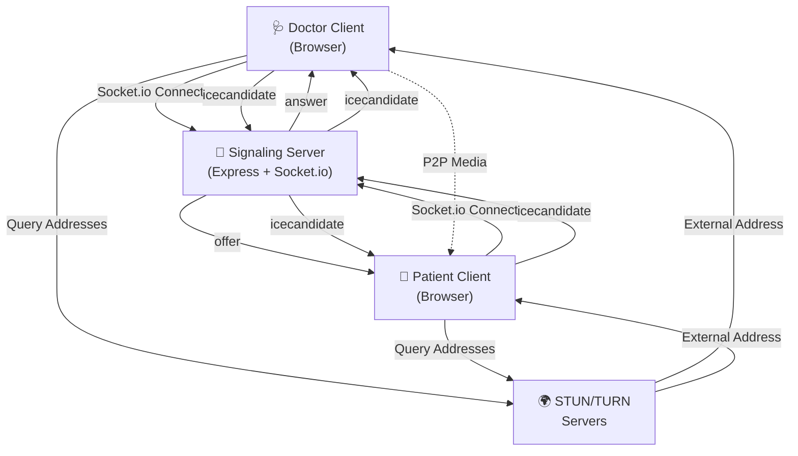
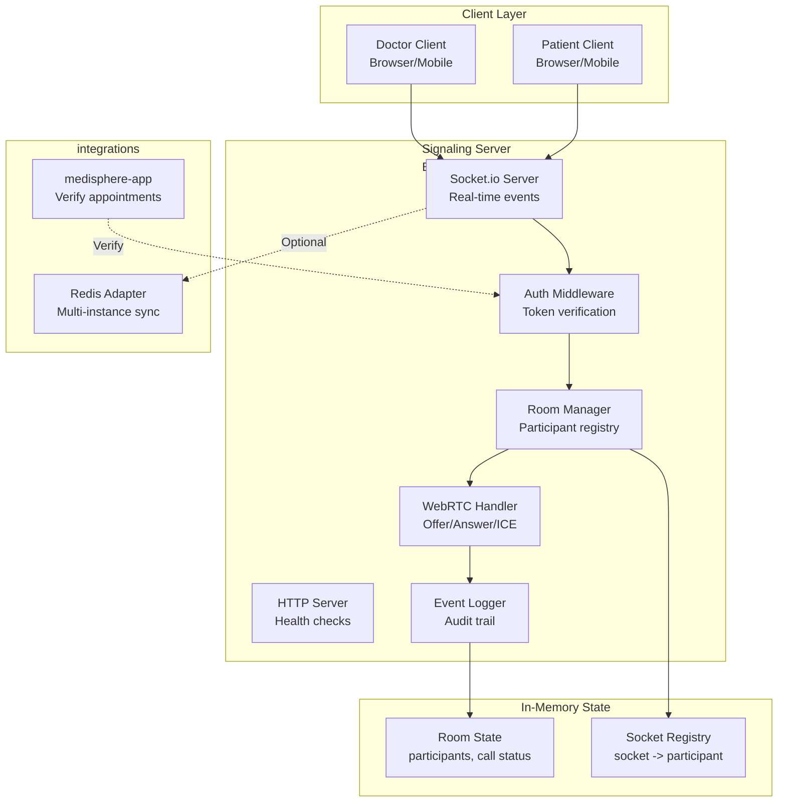
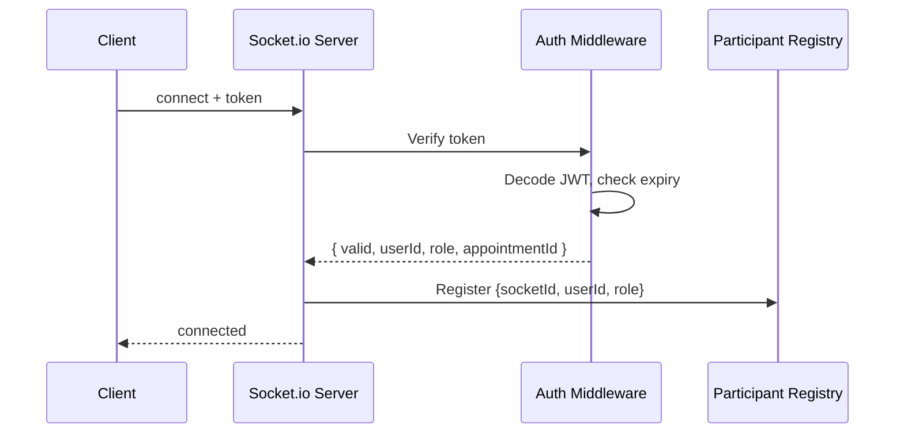
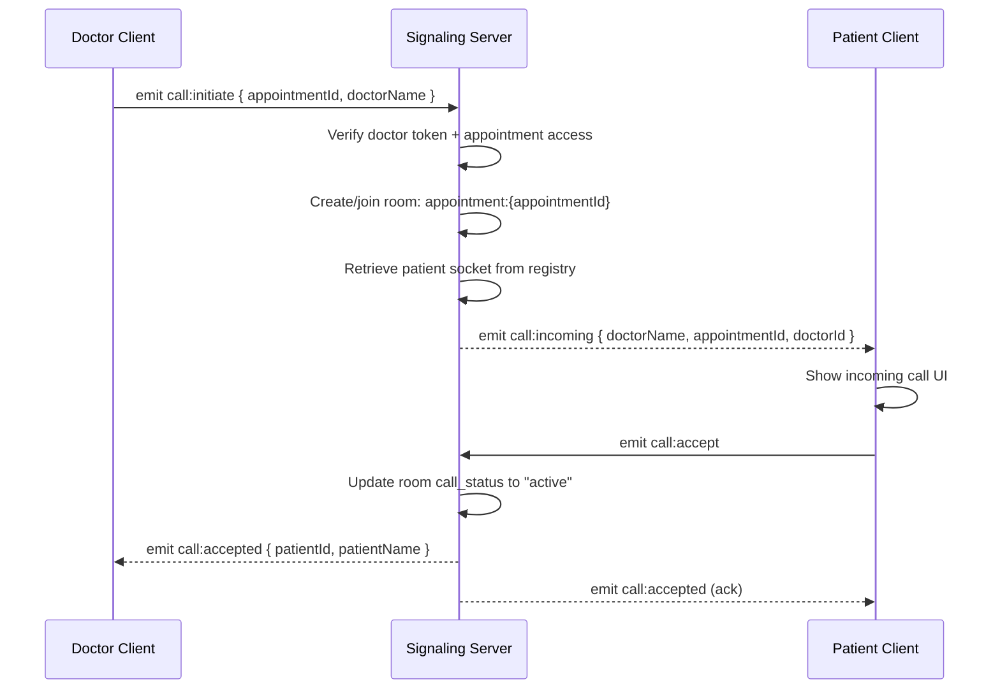
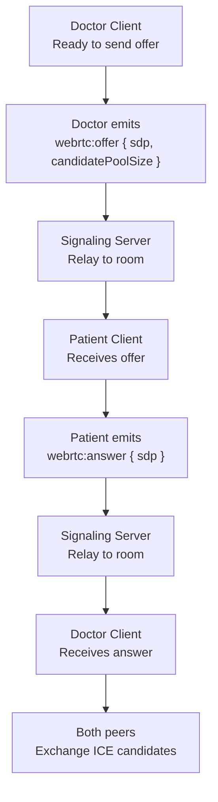
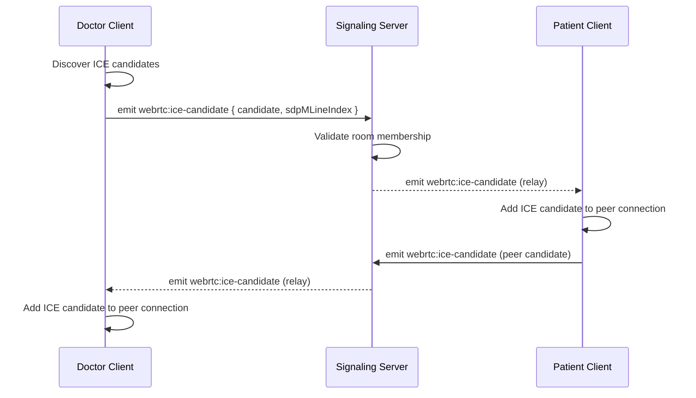
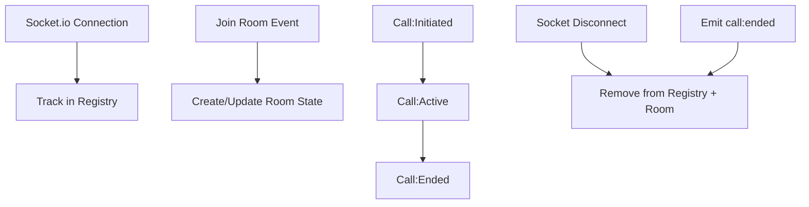
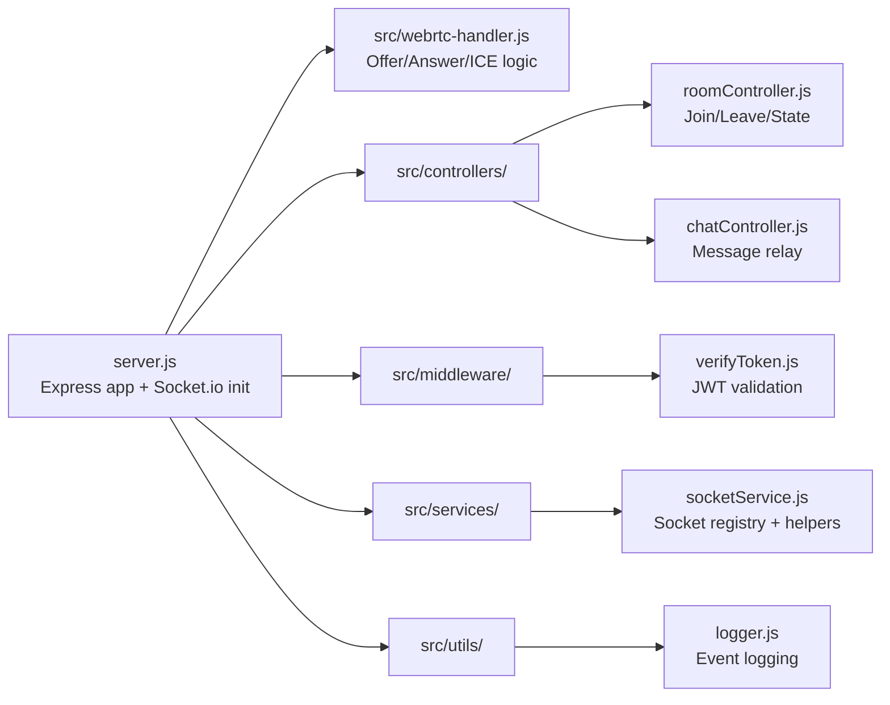
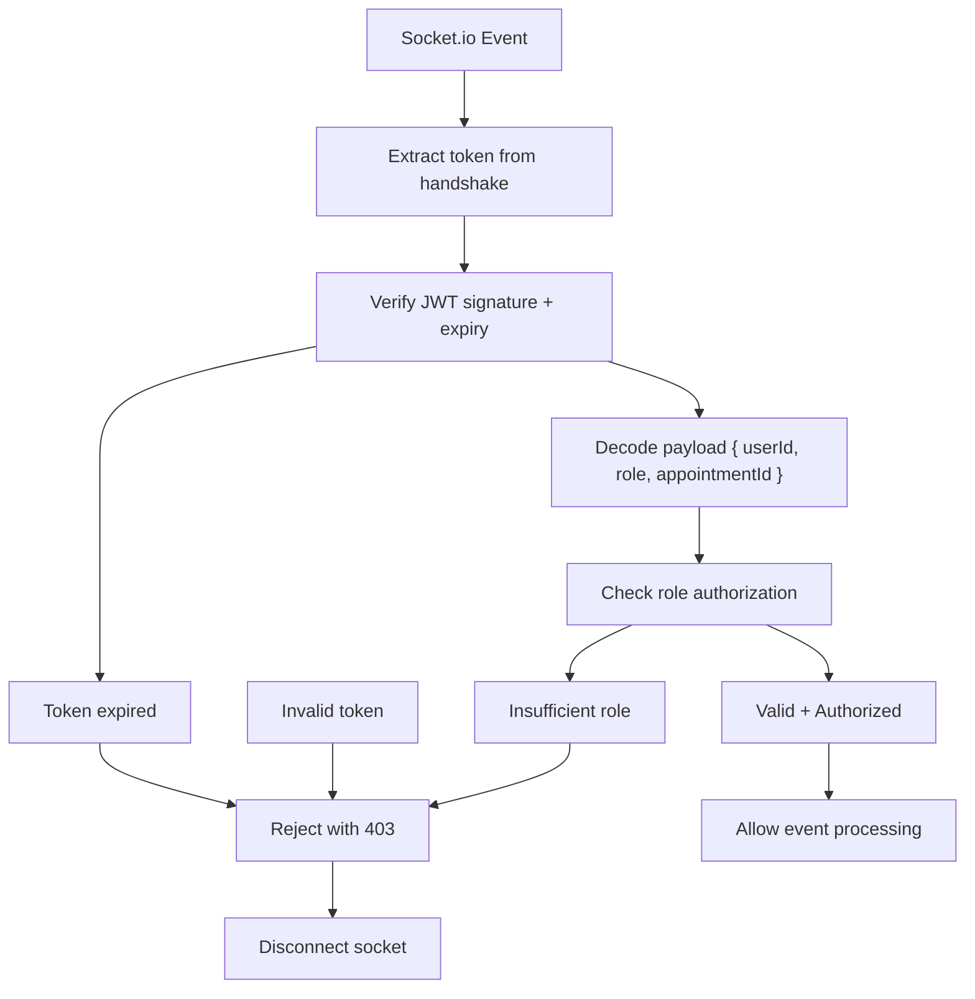

# Medisphere Signaling Service - Express + Socket.io

> Real-time WebRTC signaling server orchestrating peer connections, chat events, and room management for video consultations.

## 📚 Service Documentation Map

- **[← Back to Main README](../README.md)** - Medisphere overview
- **[Frontend Service README](../medisphere-app/README.md)** - Next.js + API routes
- **[Signaling Service README](./README.md)** - You are here
- **[ARCHITECTURE.md](../ARCHITECTURE.md)** - System design patterns

---

## 📋 Table of Contents

1. [Overview](#overview)
2. [Architecture](#architecture)
3. [Core Services](#core-services)
4. [Event Reference](#event-reference)
5. [Room Management](#room-management)
6. [WebRTC Signaling](#webrtc-signaling)
7. [Development Setup](#development-setup)
8. [Deployment](#deployment)
9. [Troubleshooting](#troubleshooting)
10. [Performance Tuning](#performance-tuning)

---

## Overview

The Signaling Service is a dedicated Express.js server powered by Socket.io, handling:

- **WebRTC Signal Relay**: Offer/answer/ICE candidate forwarding between peers
- **Room Orchestration**: Meeting creation, user joining, participant tracking
- **Real-Time Events**: Chat, typing indicators, call initiation/acceptance
- **Participant Management**: Track active users, handle disconnections, cleanup
- **Event Broadcasting**: Multicast events to specific rooms or users

### Why a Dedicated Signaling Service?

- **Decoupling**: Independent scaling from frontend service
- **Low Latency**: Optimized for real-time event streaming
- **Scalability**: Can horizontal scale with load balancer + sticky sessions
- **Reliability**: Dedicated to signaling, not blocked by long API requests

---

## Architecture

### High-Level Signaling Flow



### Service Architecture Layers

```
┌─────────────────────────────────────────┐
│    Socket.io Event Handlers             │
│  (connection, disconnect, custom events)│
├─────────────────────────────────────────┤
│  Controllers (roomController,            │
│  chatController, webrtcHandler)         │
├─────────────────────────────────────────┤
│  Services (socketService for state mgmt)│
├─────────────────────────────────────────┤
│  Middleware (Token verification)        │
├─────────────────────────────────────────┤
│  Express Server + Socket.io             │
└─────────────────────────────────────────┘
```

### Project Structure

```
medisphere-signaling-server/
├── server.js                    # Entry point, Express + Socket.io setup
├── src/
│   ├── controllers/
│   │   ├── roomController.js    # Room join/leave/list logic
│   │   └── chatController.js    # Chat & typing events
│   │
│   ├── webrtc-handler.js        # Offer/answer/ICE relay
│   │
│   ├── services/
│   │   └── socketService.js     # In-memory room & user state
│   │
│   ├── middleware/
│   │   └── verifyToken.js       # JWT token validation
│   │
│   └── utils/
│       └── logger.js            # Logging utility
│
├── .env.example                 # Environment template
├── package.json
└── README.md                    # You are here
```

---

## Core Services

### 1. Socket Service (`socketService.js`)

Manages in-memory state for rooms and participants.

```typescript
// Room structure
{
  roomId: {
    participantId: {
      socketId: "abc123",
      userId: "user-001",
      userName: "Dr. Smith",
      role: "doctor",
      connectedAt: timestamp,
      isAudioEnabled: true,
      isVideoEnabled: true
    },
    // ... more participants
  }
}
```

**Key Methods**:
```javascript
socketService.createRoom(roomId, metadata)
socketService.joinRoom(roomId, participantId, socketData)
socketService.leaveRoom(roomId, participantId)
socketService.getRoomParticipants(roomId)
socketService.getParticipantByUserId(userId)
```

### 2. Room Controller (`roomController.js`)

Handles meeting lifecycle events.

```javascript
// Join a room
socket.emit('room:join', {
  roomId: "apt-123",
  userId: "user-456",
  userName: "Dr. Smith",
  role: "doctor"
});

// Receive confirmation
socket.on('room:joined', {
  participants: [...],
  metadata: {}
});

// Leave room
socket.emit('room:leave', { roomId: "apt-123" });
```

### 3. WebRTC Handler (`webrtc-handler.js`)

Relays WebRTC signaling messages.

```javascript
// Peer A sends offer
socket.emit('webrtc:offer', {
  roomId: "apt-123",
  to: "peer-b-socket-id",
  sdp: {...}  // Session Description
});

// Peer B receives
socket.on('webrtc:offer', (data) => {
  // Create answer
  socket.emit('webrtc:answer', {
    roomId: "apt-123",
    to: "peer-a-socket-id",
    sdp: {...}
  });
});

// ICE candidate exchange
socket.emit('webrtc:icecandidate', {
  roomId: "apt-123",
  to: "target-socket-id",
  candidate: {...}
});
```

### 4. Chat Controller (`chatController.js`)

Handles text messaging and typing indicators.

```javascript
// Send message
socket.emit('message:send', {
  roomId: "apt-123",
  text: "How are you?",
  timestamp: Date.now()
});

// Typing indicator
socket.emit('typing:start', { roomId: "apt-123" });
socket.emit('typing:stop', { roomId: "apt-123" });
```

---

## Event Reference

### Connection Events

#### `connection`
New client connects to server.

```javascript
io.on('connection', (socket) => {
  // New socket connected, ready to authenticate
  console.log(`New connection: ${socket.id}`);
});
```

#### `disconnect`
Client disconnects (network loss, logout, etc).

```javascript
socket.on('disconnect', () => {
  // Cleanup: remove from rooms, notify others
  // Called automatically by Socket.io
});
```

#### `connect_error`
Connection failed (auth, protocol, etc).

```javascript
socket.on('connect_error', (error) => {
  console.error(`Connection error: ${error}`);
});
```

---

### Room Management Events

#### `room:join`
Join a meeting room.

**Emit** (by client):
```javascript
{
  roomId: "appointment-123",
  userId: "user-456",
  userName: "Dr. Smith",
  role: "doctor",  // or "patient"
  metadata: {}     // optional custom data
}
```

**Receive** (response):
```javascript
{
  success: true,
  participants: [
    { userId, userName, role, socketId, status },
    // ...
  ],
  roomMetadata: {}
}
```

#### `room:leave`
Leave the meeting room.

**Emit**:
```javascript
{
  roomId: "appointment-123"
}
```

**Broadcast to room**:
```javascript
{
  participantLeft: {
    userId,
    userName
  }
}
```

#### `room:participants`
Get current room participant list.

**Emit**:
```javascript
{ roomId: "appointment-123" }
```

**Receive**:
```javascript
{
  participants: [
    { userId, userName, role, socketId },
    // ...
  ]
}
```

---

### WebRTC Signaling Events

#### `webrtc:offer`
Send WebRTC offer (SDP) to peer.

**Emit**:
```javascript
{
  roomId: "apt-123",
  to: "peer-socket-id",  // target socket
  sdp: {
    type: "offer",
    sdp: "v=0\r\n..."  // SDP string
  }
}
```

**Relay to peer**:
```javascript
{
  from: "caller-socket-id",
  roomId: "apt-123",
  sdp: {...}
}
```

#### `webrtc:answer`
Send WebRTC answer (SDP) to peer.

**Emit**:
```javascript
{
  roomId: "apt-123",
  to: "peer-socket-id",
  sdp: {
    type: "answer",
    sdp: "v=0\r\n..."
  }
}
```

#### `webrtc:icecandidate`
Send ICE candidate for NAT traversal.

**Emit**:
```javascript
{
  roomId: "apt-123",
  to: "peer-socket-id",
  candidate: {
    candidate: "candidate:...",
    sdpMLineIndex: 0,
    sdpMid: "0"
  }
}
```

**Relay Logic**:
- Server receives from Peer A
- Finds Peer B by target socket ID
- Forwards candidate to Peer B

---

### Chat & Messaging Events

#### `message:send`
Send text message to room.

**Emit**:
```javascript
{
  roomId: "apt-123",
  text: "How are you feeling today?",
  timestamp: Date.now()
}
```

**Broadcast to room**:
```javascript
{
  from: {
    userId,
    userName
  },
  text: "...",
  timestamp
}
```

#### `typing:start`
Indicate user is typing.

**Emit**:
```javascript
{ roomId: "apt-123" }
```

**Broadcast**:
```javascript
{
  isTyping: true,
  from: { userId, userName }
}
```

#### `typing:stop`
Indicate user stopped typing.

**Emit**:
```javascript
{ roomId: "apt-123" }
```

**Broadcast**:
```javascript
{
  isTyping: false,
  from: { userId, userName }
}
```

---

### Call Control Events

#### `call:initiate`
Doctor initiates a call to patient.

**Emit** (by doctor):
```javascript
{
  appointmentId: "apt-123",
  roomId: "room-123",
  doctorName: "Dr. Smith"
}
```

**Broadcast to patient**:
```javascript
{
  incomingCall: {
    appointmentId,
    doctorName,
    roomId
  }
}
```

#### `call:accept`
Patient accepts incoming call.

**Emit**:
```javascript
{
  appointmentId: "apt-123",
  roomId: "room-123"
}
```

**Broadcast to doctor**:
```javascript
{
  callAccepted: {
    appointmentId,
    roomId
  }
}
```

#### `call:decline`
Patient rejects call.

**Emit**:
```javascript
{
  appointmentId: "apt-123"
}
```

**Broadcast to doctor**:
```javascript
{
  callDeclined: {
    reason: "patient-declined"  // or "timeout"
  }
}
```

#### `call:end`
Either party ends the call.

**Emit**:
```javascript
{
  roomId: "apt-123"
}
```

**Broadcast**:
```javascript
{
  callEnded: {
    reason: "user-ended"  // or "network-lost"
  }
}
```

---

## Room Management

### Room Lifecycle

```
1. room:join (first participant)
   ├─ Create room in memory
   └─ Add participant to room
   
2. room:join (second participant)
   ├─ Add participant to room
   └─ Notify both participants
   
3. WebRTC exchange
   ├─ offer → answer → ICE candidates
   └─ P2P connection established
   
4. room:leave or disconnect
   ├─ Remove participant
   ├─ Notify room
   └─ Cleanup if room empty
```

### Participant State

Each participant in a room maintains:

```javascript
{
  socketId: "socket-abc123",      // Socket.io ID
  userId: "user-456",             // App user ID
  userName: "Dr. Smith",
  role: "doctor",                 // or "patient"
  connectedAt: 1712000000,        // Timestamp
  isAudioEnabled: true,
  isVideoEnabled: true,
  mediaStatus: {                  // Optional
    bitrate: "2.5mbps",
    latency: "45ms"
  }
}
```

### Room Cleanup

When a room becomes empty:
1. Remove room from in-memory store
2. Clear all associated data
3. Log room closure for analytics

---

## WebRTC Signaling

### SDP Exchange Protocol

```
┌─────────────────────────────────────────────────────────┐
│ Client A: Create RTCPeerConnection                      │
│ Client A: addTrack(audio, video)                        │
│ Client A: createOffer()                                 │
└─────────────────────────────────────────────────────────┘
                          ↓
                   (WebRTC Offer SDP)
                          ↓
┌─────────────────────────────────────────────────────────┐
│ Signaling Server: Relay offer to Client B              │
└─────────────────────────────────────────────────────────┘
                          ↓
┌─────────────────────────────────────────────────────────┐
│ Client B: Create RTCPeerConnection                      │
│ Client B: addTrack(audio, video)                        │
│ Client B: setRemoteDescription(offer)                   │
│ Client B: createAnswer()                                │
└─────────────────────────────────────────────────────────┘
                          ↓
                   (WebRTC Answer SDP)
                          ↓
┌─────────────────────────────────────────────────────────┐
│ Signaling Server: Relay answer to Client A             │
└─────────────────────────────────────────────────────────┘
                          ↓
┌─────────────────────────────────────────────────────────┐
│ Client A: setRemoteDescription(answer)                  │
└─────────────────────────────────────────────────────────┘

Parallel: ICE Candidate Exchange
┌─────────────────────────────────────────────────────────┐
│ Client A: onicecandidate → Relay to Server → B         │
│ Client B: onicecandidate → Relay to Server → A         │
│ Both: addIceCandidate()                                │
└─────────────────────────────────────────────────────────┘
                          ↓
                   (P2P Connected)
```

### Candidate Trickling

ICE candidates are sent as they're generated (not batched):

```javascript
peerConnection.onicecandidate = (event) => {
  if (event.candidate) {
    // Send each candidate immediately
    socket.emit('webrtc:icecandidate', {
      roomId,
      to: peerId,
      candidate: event.candidate
    });
  }
};
```

---

## Development Setup

### Prerequisites
- Node.js 18+
- npm or yarn
- Port 8000 available (or configure in .env)

### Installation

```bash
# Navigate to signaling server
cd medisphere-signaling-server

# Install dependencies
npm install

# Setup environment
cp .env.example .env

# Configure .env
# PORT=8000
# NODE_ENV=development
# JWT_SECRET=your-secret
```

### Environment Variables

```env
# Server
PORT=8000
NODE_ENV=development

# Authentication
JWT_SECRET=your-jwt-secret-min-32-chars
NEXTAUTH_SECRET=sync-with-frontend

# STUN/TURN (optional, fallback to Google STUN)
STUN_SERVER=stun.l.google.com:19302
TURN_SERVER=your-turn-server.com
TURN_USER=username
TURN_PASS=password

# Logging
LOG_LEVEL=debug

# Rate Limiting
RATE_LIMIT_WINDOW_MS=60000
RATE_LIMIT_MAX_REQUESTS=100
```

### Development Server

```bash
# Start with Node
npm start

# Or with hot reload (using nodemon)
npm run dev

# Watch file changes
npm run dev:watch
```

### Health Check

```bash
curl http://localhost:8000/health

# Expected response:
{
  "status": "ok",
  "uptime": 1234,
  "connections": 5
}
```

---

## Deployment

### Production Build

```bash
# Build optimizations (if any)
npm run build

# Start production server
NODE_ENV=production npm start
```

### Docker Deployment

```dockerfile
FROM node:18-alpine

WORKDIR /app
COPY package*.json ./
RUN npm ci --omit=dev

COPY src ./src
COPY server.js .

EXPOSE 8000
CMD ["node", "server.js"]
```

**Build & Run**:
```bash
docker build -t medisphere-signaling:latest .
docker run -p 8000:8000 \
  -e PORT=8000 \
  -e JWT_SECRET=<secret> \
  medisphere-signaling:latest
```

### Load Balancing (Multiple Instances)

For horizontal scaling:

1. **Sticky Sessions**: Use IP hash or session ID to route client back to same server
2. **Redis Adapter**: Use Socket.io Redis adapter for cross-server messaging

```javascript
const { createAdapter } = require("@socket.io/redis-adapter");
const { createClient } = require("redis");

const pubClient = createClient();
const subClient = pubClient.duplicate();

io.adapter(createAdapter(pubClient, subClient));
```

### Reverse Proxy (Nginx)

```nginx
upstream signaling_servers {
    ip_hash;  # Sticky sessions
    server backend1.local:8000;
    server backend2.local:8000;
    server backend3.local:8000;
}

server {
    listen 443 ssl;
    server_name signals.medisphere.com;
    
    ssl_certificate /etc/ssl/certs/medisphere.crt;
    ssl_certificate_key /etc/ssl/private/medisphere.key;
    
    location / {
        proxy_pass http://signaling_servers;
        proxy_http_version 1.1;
        proxy_set_header Upgrade $http_upgrade;
        proxy_set_header Connection "upgrade";
        proxy_set_header Host $host;
        proxy_set_header X-Real-IP $remote_addr;
    }
}
```

---

## Troubleshooting

### Socket Won't Connect

**Error**: `WebSocket connection to 'ws://localhost:8000/socket.io/' failed`

**Solutions**:
```bash
# Check signaling server is running
curl http://localhost:8000/health

# Check port is open
netstat -an | grep 8000

# Check frontend is using correct URL
NEXT_PUBLIC_SIGNALING_URL=http://localhost:8000
```

### ICE Candidates Not Exchanged

**Error**: Connection stuck in "checking" state

**Solutions**:
1. Verify STUN server is accessible
2. Check firewall allows UDP ports
3. Enable IPv6 if behind NAT:
```javascript
iceServers: [
  { urls: 'stun:stun.l.google.com:19302' },
  { urls: 'stun:stun1.l.google.com:19302' }
]
```

### Room Not Cleaning Up

**Symptom**: Old room data persists in memory

**Solution**: Add periodic cleanup:
```javascript
setInterval(() => {
  Object.entries(rooms).forEach(([roomId, room]) => {
    if (Object.keys(room).length === 0) {
      delete rooms[roomId];
    }
  });
}, 60000);  // Every 60 seconds
```

### High Latency

**Symptom**: >200ms roundtrip on signaling

**Solutions**:
```bash
# Check server CPU/memory
top
free -h

# Profile Node.js
node --prof server.js
node --prof-process isolate-*.log > profile.txt

# Use profiling tools
npm install clinic
clinic doctor -- node server.js
```

---

## Performance Tuning

### Memory Optimization

- **Limit room history**: Don't store all past events
- **Cleanup disconnects**: Remove user from room immediately
- **Session storage**: Use external store (Redis) for large deployments

### CPU Optimization

- **Reduce logging**: Set `LOG_LEVEL=error` in production
- **Batch broadcasts**: Use Socket.io namespaces to reduce message overhead
- **Worker threads**: Use Node.js worker threads for CPU-bound tasks

### Network Optimization

- **Compression**: Enable gzip for HTTP, compress Socket.io messages
- **Message batching**: Bundle multiple events before sending
- **Rate limiting**: Prevent client spam

```javascript
const rateLimit = require('express-rate-limit');

app.use(rateLimit({
  windowMs: 60 * 1000,
  max: 100
}));
```

### Monitoring

Recommended tools:
- **PM2**: Process manager with auto-restart
- **Prometheus**: Metrics collection
- **ELK Stack**: Centralized logging
- **Grafana**: Dashboards and alerts

---

## Contributing

1. Create feature branch
2. Follow existing code style
3. Test with multiple concurrent peers
4. Update documentation
5. Submit PR

---

## Support

- 📧 Email: support@medisphere.dev
- 🐛 Issues: GitHub Issues
- 📖 Wiki: For advanced topics

---

**Last Updated**: April 2026  
**Service Maintainer**: Medisphere Backend Team

## 3. Feature Scope Classification (Big Features vs Small/Medium Features)

### Big Features (Platform-defining)

| Feature | Why it is a big feature |
|---|---|
| WebRTC Signaling Orchestration | Complex state machine for offer/answer/ICE exchanges; critical for establishing peer connections |
| Call Session Management | Full lifecycle from initiation → acceptance → media exchange → termination with role enforcement |
| Room-based Isolation | Multi-appointment support, ensures participants only see events for their own calls |
| Real-time Event Streaming | Socket.io subscriptions for notifications, call state changes, and messaging |
| Participant Registry | Tracks doctor/patient roles, connection states, and enforces appointment-specific access |

### Small to Medium Features (Focused capabilities)

| Feature | Description |
|---|---|
| Guest Call Support | Non-authenticated participants can join certain rooms with temporary tokens |
| In-call Chat Messaging | Text messages broadcast to room participants, useful for notes/instructions |
| Connection Monitoring | Detects participant disconnections and cleans up stale room state |
| Health Check Endpoint | Simple HTTP endpoint for health monitoring and load balancer checks |
| Event Logging | Call initiation, acceptance, decline, and end events logged for audit/analytics |

## 4. Problem Statement/Objectives

### Problem Statement

Real-time video consultation requires complex coordination:
- **Peer Discovery**: Patients and doctors need to find each other's network details without exposing IP addresses
- **NAT Traversal**: Network address translation in home/office networks requires STUN/TURN infrastructure
- **Stateful Session Management**: Call state must be maintained and synchronized across both peers
- **Scalability**: A centralized monolith struggle under hundreds of concurrent calls
- **Security**: Unauthenticated access or cross-appointment bleeding would compromise patient privacy

Existing solutions often lack dedicated signaling infrastructure, leading to latency spikes, session loss, and poor scalability.

### Objectives

1. Provide a lightweight, stateless signaling service for WebRTC peer discovery and coordination
2. Support appointment-specific call rooms with role-based access control
3. Enable doctor-initiated and patient-accepted call workflows with explicit state transitions
4. Relay WebRTC signaling messages (offer/answer/ICE) without processing/modifying them
5. Maintain low latency (<100ms) for call initiation and message delivery
6. Support horizontal scaling with Redis adapters for multi-instance deployments
7. Provide robust error handling and graceful degradation under load
8. Enable audit logging for compliance and troubleshooting

## 5. Proposed System / Methodology

### 5.1 Proposed System

The medisphere-signaling-server is implemented as:

- **Express Framework**: Minimal HTTP routing for health checks and static content
- **Socket.io Server**: Real-time bidirectional communication using WebSocket + fallback transports
- **Room-based Architecture**: Each appointment maps to a Socket.io room for participant isolation
- **Token Verification**: One-time or persistent JWT validation for authentication
- **WebRTC Handler Module**: Encapsulates signaling logic (offer/answer/ICE relay)
- **Room Controller**: Manages room join, leave, call workflows
- **Stateless Design**: All state stored in Socket.io memory adapter (or Redis for scaling)

### 5.2 Engineering Methodology

The implementation follows event-driven, distributed design:

1. **Event-Driven Architecture**: Socket.io handlers respond to client events (call:initiate, webrtc:offer, etc.)
2. **Room Isolation**: All events are scoped to rooms; participants outside a room don't receive events
3. **Middleware Pattern**: Token verification, logging, and error handling applied at entry points
4. **Graceful Degradation**: Partial failures (e.g., message loss) don't crash the server
5. **Stateless Server**: Enable load balancing and container orchestration without sticky sessions
6. **Security-First**: All events require authentication tokens; role checks enforce doctor-patient boundaries

### 5.3 Functional Method Flow (Example: Doctor Initiates Call)

```
1. Doctor client emits: call:initiate { appointmentId, doctorName, doctorId }
2. Signaling server verifies doctor token and appointment access
3. Server joins doctor to room: "appointment:{appointmentId}"
4. Server retrieves patient socket from participant registry
5. Server emits to patient: call:incoming { doctorName, appointmentId }
6. Patient sees incoming call UI and chooses accept/decline
7. If patient accepts: emits call:accept
8. Server emits to doctor: call:accepted
9. Both peers now ready for WebRTC offer/answer exchange
10. WebRTC peer connection established via ICE relay
11. Media streams flow peer-to-peer (not through signaling server)
```

## 6. System Architecture / Design (HLD and LLD)

### 6.1 Signaling Server High-Level Design



### 6.2 Low-Level Design (LLD) - Signaling Server Internals

#### A. Socket.io Connection and Authentication Flow



#### B. Call Initiation Workflow



#### C. WebRTC Signaling (Offer/Answer/ICE)



#### D. Event Flow - ICE Candidate Relay



#### E. Room and Participant State Management



#### F. Module Structure



#### G. Authentication and Authorization Flow



## 7. Tools & Technologies Used

### 7.1 Core Framework and Server

| Technology | Version | Usage |
|---|---|---|
| Node.js | 18+ | Runtime environment |
| Express | 4.x | HTTP server, routing, middleware |
| Socket.io | 4.x | Real-time bidirectional communication |
| Socket.io Server Types | Latest | TypeScript definitions for Socket.io |

### 7.2 Authentication and Security

| Technology | Usage |
|---|---|
| jsonwebtoken (jwt) | JWT token creation and verification |
| Helmet | Secure HTTP headers and middleware |
| CORS Middleware | Cross-origin resource sharing control |
| Environment Variables | API key and configuration management |

### 7.3 Messaging and Event Handling

| Technology | Usage |
|---|---|
| Socket.io Rooms | Event isolation and multi-user support |
| Socket.io Adapters | Memory (default) or Redis for scaling |
| Event Emitters | Pattern for handling async events |

### 7.4 Development and Deployment

| Technology | Usage |
|---|---|
| Nodemon | Auto-restart on file changes (development) |
| dotenv | Environment variable loading |
| npm / yarn | Dependency management |

### 7.5 Optional Scaling (Redis Adapter)

| Technology | Usage |
|---|---|
| Redis | Pub/sub adapter for multi-instance deployments |
| socket.io-redis | Redis adapter for Socket.io |

## 8. Directory Structure

```text
medisphere-signaling-server/
├── server.js                       # Entry point, Express + Socket.io setup
├── package.json                    # Node.js dependencies
├── .env.example                    # Example environment variables
├── .env                            # Actual environment config (not in git)
├── src/
│   ├── webrtc-handler.js          # WebRTC signaling logic (offer/answer/ICE)
│   ├── controllers/
│   │   ├── roomController.js      # Call:initiate, accept, decline, end
│   │   └── chatController.js      # In-room messaging
│   ├── middleware/
│   │   └── verifyToken.js         # JWT validation middleware
│   ├── services/
│   │   └── socketService.js       # Socket registry, participant tracking
│   ├── utils/
│   │   └── logger.js              # Event logging and audit trail
│   └── constants.js                # Event names, error codes, configs
├── logs/                           # Event logs (if file-based logging enabled)
└── README.md                       # This file
```

## 9. Key Event Handlers and Responsibilities

### Call Management Events

| Event | Direction | Responsibility | Role Required |
|---|---|---|---|
| `call:initiate` | Client → Server | Doctor initiates call for appointment | Doctor |
| `call:incoming` | Server → Client | Notify patient of incoming call | - |
| `call:accept` | Client → Server | Patient accepts incoming call | Patient |
| `call:declined` | Client → Server | Patient declines incoming call | Patient |
| `call:ended` | Client → Server | Either peer ends the call | Doctor/Patient |
| `call:accepted` | Server → Client | Confirm acceptance to both peers | - |

### WebRTC Signaling Events

| Event | Direction | Responsibility | Role Required |
|---|---|---|---|
| `webrtc:offer` | Doctor → Server → Patient | Doctor sends SDP offer | Doctor |
| `webrtc:answer` | Patient → Server → Doctor | Patient sends SDP answer | Patient |
| `webrtc:ice-candidate` | Bidirectional | Relay ICE candidates for NAT traversal | Any |

### Messaging Events

| Event | Direction | Responsibility | Role Required |
|---|---|---|---|
| `chat:message` | Client → Server → Room | Broadcast text message to room participants | Any |
| `notification:*` | Server → Client | Send operational or status notifications | - |

## 10. Setup and Run

### Prerequisites

- Node.js 18+ and npm/yarn
- Access to medisphere-app for appointment verification
- Optional: Redis instance (for multi-instance deployments)

### Quick Setup

```bash
# 1. Navigate to signaling server
cd medisphere-signaling-server

# 2. Install dependencies
npm install

# 3. Create and configure environment
cp .env.example .env
# Edit .env with your API keys and configuration

# 4. Run development server
npm run dev
```

### Running in Production

```bash
npm start
```

The signaling server will listen on:
- Socket.io: `http://localhost:4000` (WebSocket at `ws://localhost:4000`)
- Health Check: `http://localhost:4000/health`

## 11. Command Reference

### Development

```bash
# Start development server (with auto-reload)
npm run dev

# Start production server
npm start

# Run with explicit port
PORT=5000 npm start
```

### Health Checks

```bash
# Check signaling server health
curl http://localhost:4000/health

# Expected response:
# { "status": "ok", "timestamp": "2024-04-07T10:30:00Z" }
```

### Docker (Optional)

```bash
# Build Docker image
docker build -t medisphere-signaling:latest .

# Run Docker container
docker run -d \
  -p 4000:4000 \
  --env-file .env \
  --name medisphere-signaling \
  medisphere-signaling:latest
```

### Scaling with Redis

```bash
# Add Redis adapter to package.json dependencies
npm install socket.io-redis redis

# In server.js, uncomment/enable Redis adapter:
# const { createAdapter } = require("@socket.io/redis-adapter");
# const { createClient } = require("redis");
# 
# const pubClient = createClient({ host: "localhost", port: 6379 });
# const subClient = pubClient.duplicate();
# io.adapter(createAdapter(pubClient, subClient));

# Start server (uses Redis for multi-instance pub/sub)
npm start
```

## 12. Troubleshooting

### Issue: CORS Errors

**Solution**: Verify `ALLOWED_ORIGINS` environment variable includes your frontend domain.

```bash
# .env
ALLOWED_ORIGINS=http://localhost:3000,http://localhost:3001
```

### Issue: Socket Connection Fails

**Solution**: Check network connectivity and ensure signaling server is running.

```bash
curl -v http://localhost:4000/health
```

### Issue: Call State Mismatch

**Solution**: Ensure appointment verification works and tokens are valid.

```bash
# Check server logs for "Invalid token" or "Appointment not found" messages
npm run dev  # Enable logs in development
```

### Issue: ICE Candidates Not Relaying

**Solution**: Verify STUN servers are reachable and firewall allows UDP traffic.

```javascript
// In client, check WebRTC ICE candidates are being discovered
// If no candidates: network/firewall issue, not signaling server
```

## 13. Contributing Guidelines

1. Follow existing event naming conventions (`domain:action`)
2. Always verify authentication before processing events
3. Use room-based broadcasting to ensure isolation
4. Log all call initiations and state changes for audit
5. Add error handling for disconnects and invalid payloads
6. Test with multiple Socket.io connections to verify room isolation

## 14. API Documentation

Comprehensive call flow examples and integration details are available in:
- [Main Repository README](../README.md)
- [Doctor-Patient Call Flow](../DOCTOR_PATIENT_CALL_FLOW.md)
- [medisphere-app README](../medisphere-app/README.md)

---

**Related Documentation:**
- [Main Repository README](../README.md)
- [medisphere-app Frontend & Backend README](../medisphere-app/README.md)
- [WebRTC Setup Guide](../WEBRTC_SETUP.md)
- [Startup Guide](../STARTUP_GUIDE.md)
